---
execute:
  message: false
  echo: false
  warning: false
  error: false

---

# EPOC - Daten


```{r}
# Library und dfs laden
library(plotly)
library(ggplot2)
library(dplyr)
library(tidyr)
library(htmltools)
library(htmlwidgets)
library(shiny)
library(DT)
library(RColorBrewer)
library(patchwork)
library(minpack.lm)
library(zoo)
library(purrr)
library(readxl)

# Laden des DataFrames EPOC_data, Erg_data und BLC_data aus der RDS-Datei
EPOC_data_df <- readRDS("C:/Users/johan/OneDrive/Desktop/SpoWi/WS 22,23/Masterarbeit - Wirkungsgrad/Daten/Probanden_Energieberechnung/xlsm/EPOC_data_df.rds")
Erg_data_df <- readRDS("C:/Users/johan/OneDrive/Desktop/SpoWi/WS 22,23/Masterarbeit - Wirkungsgrad/Daten/Probanden_Energieberechnung/xlsm/Erg_data_df.rds")
Erg_data_komplett <- readRDS("C:/Users/johan/OneDrive/Desktop/SpoWi/WS 22,23/Masterarbeit - Wirkungsgrad/Daten/Probanden_Energieberechnung/xlsm/Erg_data_komplett.rds")
Messwerte_Bedingungen_df <- readRDS("C:/Users/johan/OneDrive/Desktop/SpoWi/WS 22,23/Masterarbeit - Wirkungsgrad/Daten/Probanden_Energieberechnung/xlsm/Messwerte_Bedingungen_df.rds")
Messwerte_Intensitäten_df <- readRDS("C:/Users/johan/OneDrive/Desktop/SpoWi/WS 22,23/Masterarbeit - Wirkungsgrad/Daten/Probanden_Energieberechnung/xlsm/Messwerte_Intensitäten_df.rds")
Messwerte_Bedingung_Intensität_df <- readRDS("C:/Users/johan/OneDrive/Desktop/SpoWi/WS 22,23/Masterarbeit - Wirkungsgrad/Daten/Probanden_Energieberechnung/xlsm/Messwerte_Bedingung_Intensität_df.rds")
Bedingungen_data <- readRDS("C:/Users/johan/OneDrive/Desktop/SpoWi/WS 22,23/Masterarbeit - Wirkungsgrad/Daten/Probanden_Energieberechnung/xlsm/Bedingungen_data.rds")
P_Ges_df<- readRDS("C:/Users/johan/OneDrive/Desktop/SpoWi/WS 22,23/Masterarbeit - Wirkungsgrad/Daten/Probanden_Energieberechnung/xlsm/Efficiency_Daten_df.rds")
Efficiency_df<- readRDS("C:/Users/johan/OneDrive/Desktop/SpoWi/WS 22,23/Masterarbeit - Wirkungsgrad/Daten/Probanden_Energieberechnung/xlsm/Efficiency_Daten_df.rds")
P_Int_Drehzahl_Masse <- readRDS("C:/Users/johan/OneDrive/Desktop/SpoWi/WS 22,23/Masterarbeit - Wirkungsgrad/Daten/Probanden_Energieberechnung/xlsm/P_Int_Drehzahl_Masse.rds")
Simulation_df <- readRDS("C:/Users/johan/OneDrive/Desktop/SpoWi/WS 22,23/Masterarbeit - Wirkungsgrad/Daten/Probanden_Energieberechnung/xlsm/Simulation_df.rds")
ΔBLC_list <- readRDS("C:/Users/johan/OneDrive/Desktop/SpoWi/WS 22,23/Masterarbeit - Wirkungsgrad/Daten/Probanden_Energieberechnung/xlsm/BLC_list.rds")
proband_data <- readRDS("C:/Users/johan/OneDrive/Desktop/SpoWi/WS 22,23/Masterarbeit - Wirkungsgrad/Daten/Probanden_Energieberechnung/xlsm/proband_data.rds")
ΔBLC_data_df <- readRDS("C:/Users/johan/OneDrive/Desktop/SpoWi/WS 22,23/Masterarbeit - Wirkungsgrad/Daten/Probanden_Energieberechnung/xlsm/BLC_data_df.rds")
BLC_Modell_list <- readRDS("C:/Users/johan/OneDrive/Desktop/SpoWi/WS 22,23/Masterarbeit - Wirkungsgrad/Daten/Probanden_Energieberechnung/xlsm/BLC_Modell_list.rds")
Efficiency_Daten_df <- readRDS("C:/Users/johan/OneDrive/Desktop/SpoWi/WS 22,23/Masterarbeit - Wirkungsgrad/Daten/Probanden_Energieberechnung/xlsm/Efficiency_Daten_df.rds")
P_R_list <- readRDS("C:/Users/johan/OneDrive/Desktop/SpoWi/WS 22,23/Masterarbeit - Wirkungsgrad/Daten/Probanden_Energieberechnung/xlsm/P_R_list.rds")
P_L_list <- readRDS("C:/Users/johan/OneDrive/Desktop/SpoWi/WS 22,23/Masterarbeit - Wirkungsgrad/Daten/Probanden_Energieberechnung/xlsm/P_L_list.rds")
start_vals_list <- readRDS ("C:/Users/johan/OneDrive/Desktop/SpoWi/WS 22,23/Masterarbeit - Wirkungsgrad/Daten/Probanden_Energieberechnung/xlsm/start_vals_list.rds")
VO2_list <- readRDS ("C:/Users/johan/OneDrive/Desktop/SpoWi/WS 22,23/Masterarbeit - Wirkungsgrad/Daten/Probanden_Energieberechnung/xlsm/VO2_list.rds")
df_anthropometrisch_female <- readRDS ("C:/Users/johan/OneDrive/Desktop/SpoWi/WS 22,23/Masterarbeit - Wirkungsgrad/Daten/Probanden_Energieberechnung/xlsm/df_anthropometrisch_female.rds")
df_anthropometrisch_male <- readRDS ("C:/Users/johan/OneDrive/Desktop/SpoWi/WS 22,23/Masterarbeit - Wirkungsgrad/Daten/Probanden_Energieberechnung/xlsm/df_anthropometrisch_male.rds")
```

## EPOC - Modelle der verschiedenen Probanden {.tabset}

### Proband 01 {.tabset}

#### Test 1

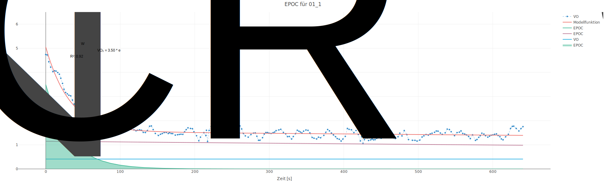

#### Test 2


#### Test 3

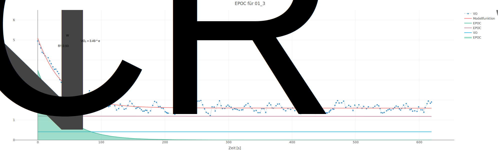

#### Test 4


#### Test 5

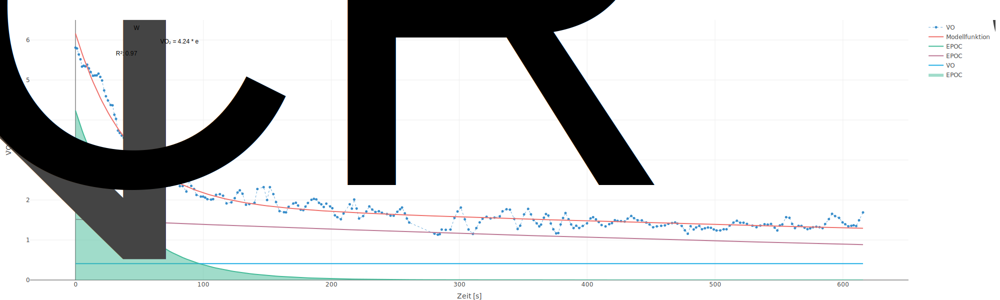

#### Test 6


### Proband 06 {.tabset}

#### Test 1


#### Test 2

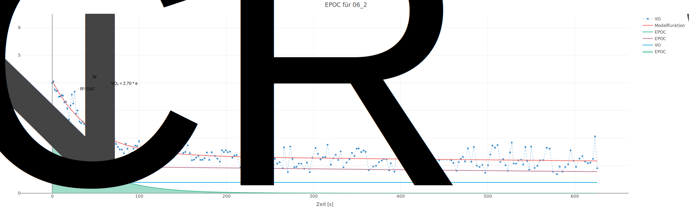

#### Test 3


#### Test 4

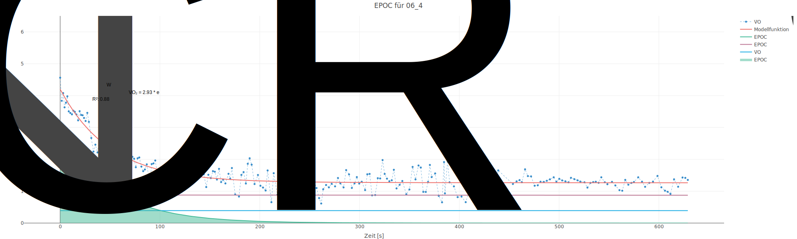

#### Test 5

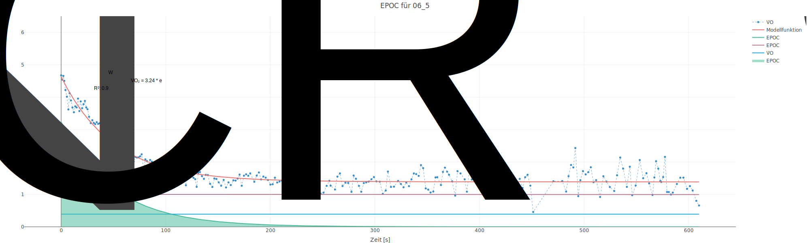

#### Test 6

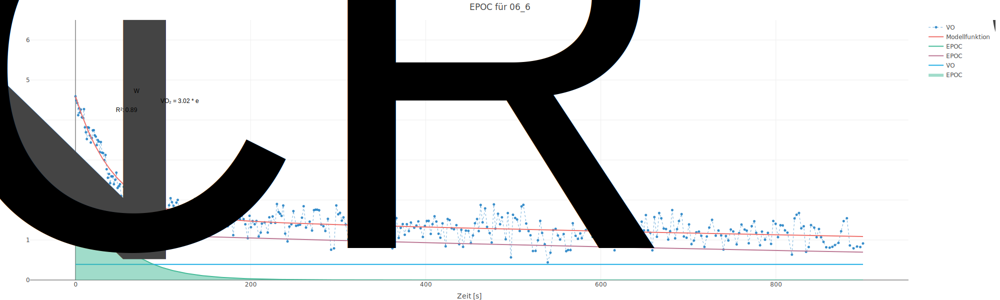

### Proband 10 {.tabset}

#### Test 1


#### Test 2


#### Test 3

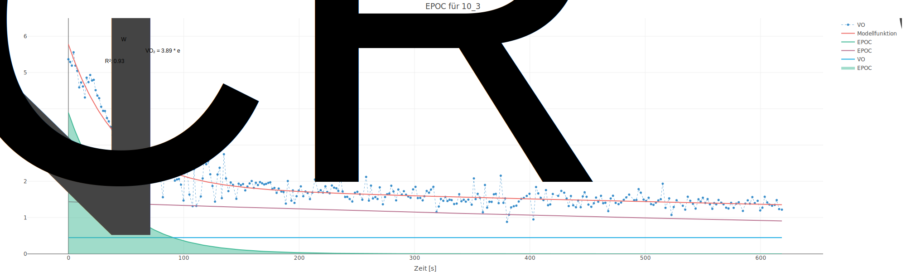

#### Test 4

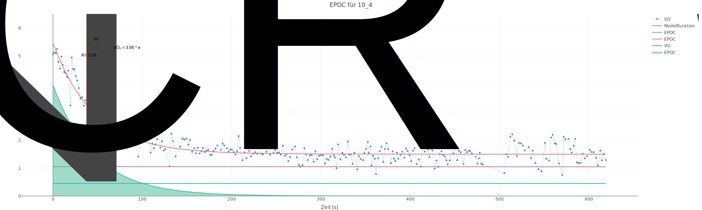

#### Test 5


#### Test 6

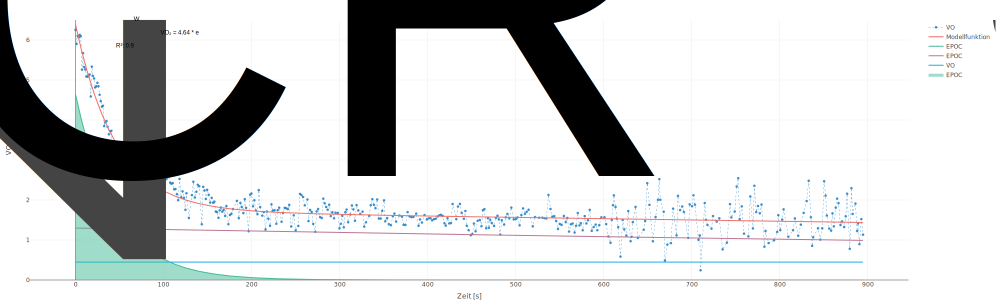

### Proband 13 {.tabset}

#### Test 1

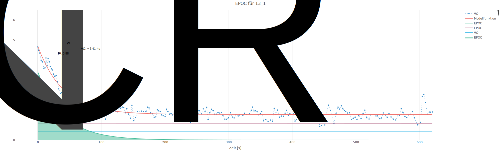

#### Test 2


#### Test 3

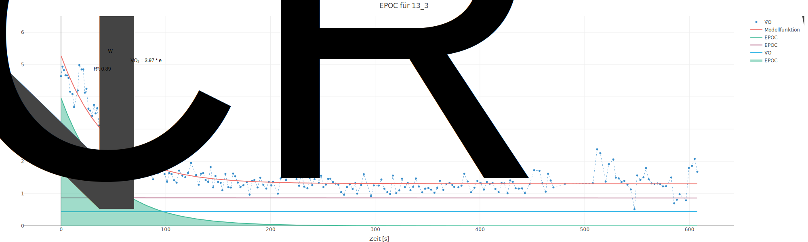

#### Test 4

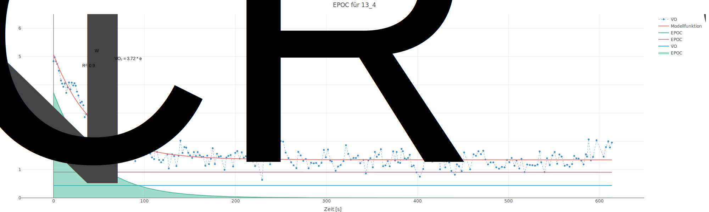

#### Test 5

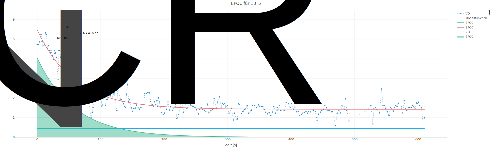

#### Test 6


### Proband 15 {.tabset}

#### Test 1


#### Test 2


#### Test 3


#### Test 4


#### Test 5


#### Test 6


### Proband 19 {.tabset}

#### Test 1

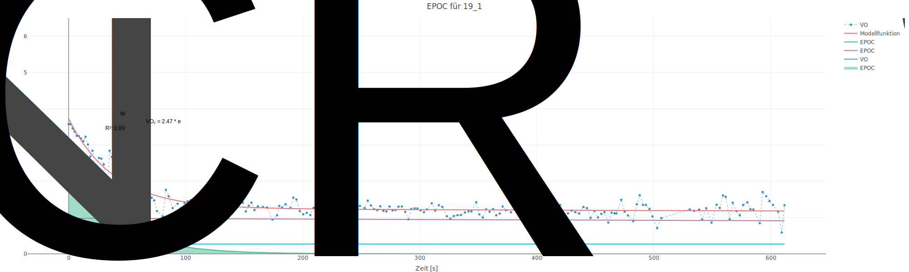

#### Test 2

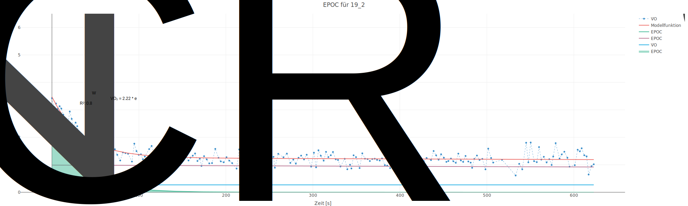

#### Test 3

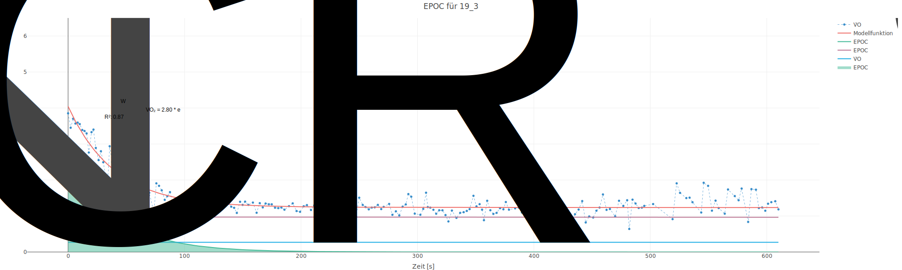

#### Test 4

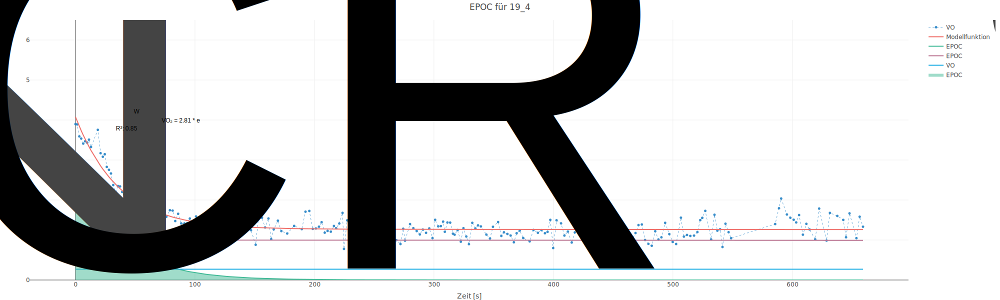

#### Test 5


#### Test 6


### Proband 20 {.tabset}

#### Test 1


#### Test 2


#### Test 3

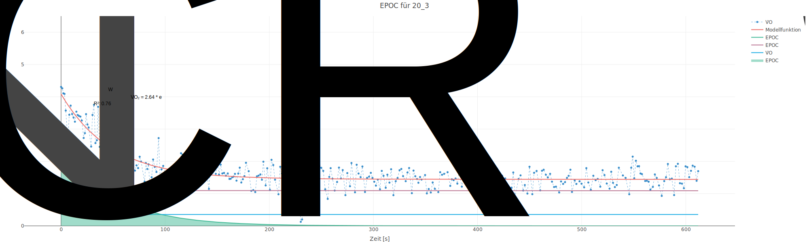

#### Test 4

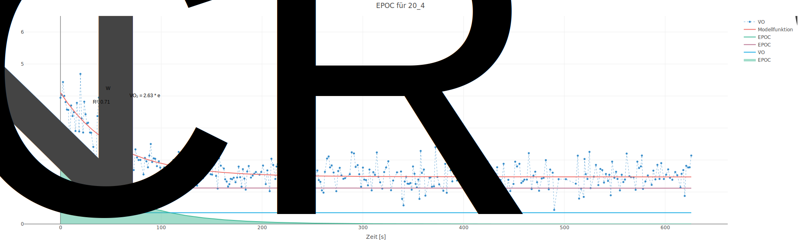

#### Test 5

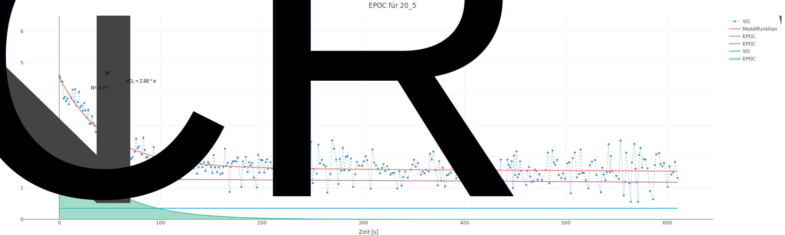

#### Test 6


### Proband 22 {.tabset}

#### Test 1

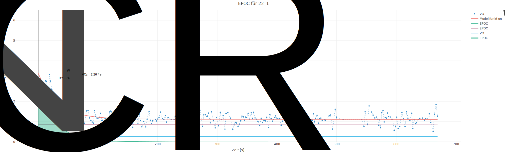

#### Test 2


#### Test 3

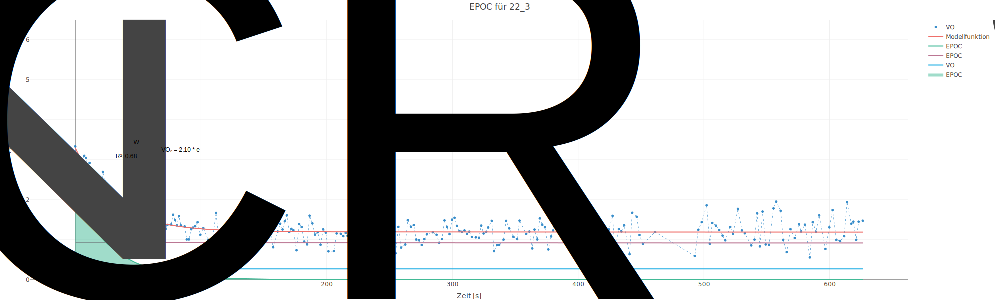

#### Test 4


#### Test 5


#### Test 6

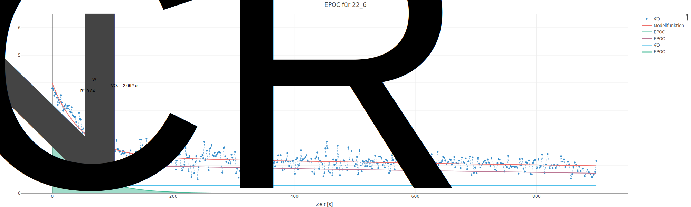

### Proband 23 {.tabset}


#### Test 2


#### Test 3


#### Test 4

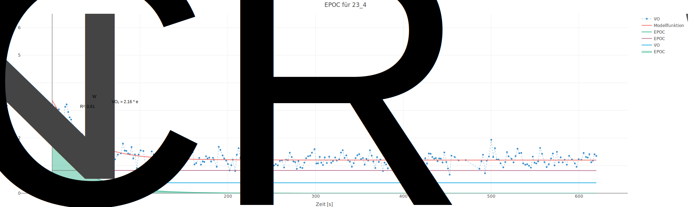

#### Test 5


#### Test 6


