---
lightbox:
  match: auto
  effect: fade
  desc-position: right
  loop: false
  css-class: "my-css-class"


execute:
  message: false
  echo: false
  warning: false
  error: false

---

# EPOC - Modelle


```{r}
# Library und dfs laden
library(plotly)
library(ggplot2)
library(dplyr)
library(tidyr)
library(htmltools)
library(htmlwidgets)
library(shiny)
library(DT)
library(RColorBrewer)
library(patchwork)
library(minpack.lm)
library(zoo)
library(purrr)
library(readxl)

# Laden des DataFrames EPOC_data, Erg_data und BLC_data aus der RDS-Datei
EPOC_data_df <- readRDS("C:/Users/johan/OneDrive/Desktop/SpoWi/WS 22,23/Masterarbeit - Wirkungsgrad/Daten/Probanden_Energieberechnung/xlsm/EPOC_data_df.rds")
Erg_data_df <- readRDS("C:/Users/johan/OneDrive/Desktop/SpoWi/WS 22,23/Masterarbeit - Wirkungsgrad/Daten/Probanden_Energieberechnung/xlsm/Erg_data_df.rds")
Erg_data_komplett <- readRDS("C:/Users/johan/OneDrive/Desktop/SpoWi/WS 22,23/Masterarbeit - Wirkungsgrad/Daten/Probanden_Energieberechnung/xlsm/Erg_data_komplett.rds")
Messwerte_Bedingungen_df <- readRDS("C:/Users/johan/OneDrive/Desktop/SpoWi/WS 22,23/Masterarbeit - Wirkungsgrad/Daten/Probanden_Energieberechnung/xlsm/Messwerte_Bedingungen_df.rds")
Messwerte_Intensitäten_df <- readRDS("C:/Users/johan/OneDrive/Desktop/SpoWi/WS 22,23/Masterarbeit - Wirkungsgrad/Daten/Probanden_Energieberechnung/xlsm/Messwerte_Intensitäten_df.rds")
Messwerte_Bedingung_Intensität_df <- readRDS("C:/Users/johan/OneDrive/Desktop/SpoWi/WS 22,23/Masterarbeit - Wirkungsgrad/Daten/Probanden_Energieberechnung/xlsm/Messwerte_Bedingung_Intensität_df.rds")
Bedingungen_data <- readRDS("C:/Users/johan/OneDrive/Desktop/SpoWi/WS 22,23/Masterarbeit - Wirkungsgrad/Daten/Probanden_Energieberechnung/xlsm/Bedingungen_data.rds")
P_Ges_df<- readRDS("C:/Users/johan/OneDrive/Desktop/SpoWi/WS 22,23/Masterarbeit - Wirkungsgrad/Daten/Probanden_Energieberechnung/xlsm/Efficiency_Daten_df.rds")
Efficiency_df<- readRDS("C:/Users/johan/OneDrive/Desktop/SpoWi/WS 22,23/Masterarbeit - Wirkungsgrad/Daten/Probanden_Energieberechnung/xlsm/Efficiency_Daten_df.rds")
P_Int_Drehzahl_Masse <- readRDS("C:/Users/johan/OneDrive/Desktop/SpoWi/WS 22,23/Masterarbeit - Wirkungsgrad/Daten/Probanden_Energieberechnung/xlsm/P_Int_Drehzahl_Masse.rds")
Simulation_df <- readRDS("C:/Users/johan/OneDrive/Desktop/SpoWi/WS 22,23/Masterarbeit - Wirkungsgrad/Daten/Probanden_Energieberechnung/xlsm/Simulation_df.rds")
ΔBLC_list <- readRDS("C:/Users/johan/OneDrive/Desktop/SpoWi/WS 22,23/Masterarbeit - Wirkungsgrad/Daten/Probanden_Energieberechnung/xlsm/BLC_list.rds")
proband_data <- readRDS("C:/Users/johan/OneDrive/Desktop/SpoWi/WS 22,23/Masterarbeit - Wirkungsgrad/Daten/Probanden_Energieberechnung/xlsm/proband_data.rds")
ΔBLC_data_df <- readRDS("C:/Users/johan/OneDrive/Desktop/SpoWi/WS 22,23/Masterarbeit - Wirkungsgrad/Daten/Probanden_Energieberechnung/xlsm/BLC_data_df.rds")
BLC_Modell_list <- readRDS("C:/Users/johan/OneDrive/Desktop/SpoWi/WS 22,23/Masterarbeit - Wirkungsgrad/Daten/Probanden_Energieberechnung/xlsm/BLC_Modell_list.rds")
Efficiency_Daten_df <- readRDS("C:/Users/johan/OneDrive/Desktop/SpoWi/WS 22,23/Masterarbeit - Wirkungsgrad/Daten/Probanden_Energieberechnung/xlsm/Efficiency_Daten_df.rds")
P_R_list <- readRDS("C:/Users/johan/OneDrive/Desktop/SpoWi/WS 22,23/Masterarbeit - Wirkungsgrad/Daten/Probanden_Energieberechnung/xlsm/P_R_list.rds")
P_L_list <- readRDS("C:/Users/johan/OneDrive/Desktop/SpoWi/WS 22,23/Masterarbeit - Wirkungsgrad/Daten/Probanden_Energieberechnung/xlsm/P_L_list.rds")
start_vals_list <- readRDS ("C:/Users/johan/OneDrive/Desktop/SpoWi/WS 22,23/Masterarbeit - Wirkungsgrad/Daten/Probanden_Energieberechnung/xlsm/start_vals_list.rds")
VO2_list <- readRDS ("C:/Users/johan/OneDrive/Desktop/SpoWi/WS 22,23/Masterarbeit - Wirkungsgrad/Daten/Probanden_Energieberechnung/xlsm/VO2_list.rds")
df_anthropometrisch_female <- readRDS ("C:/Users/johan/OneDrive/Desktop/SpoWi/WS 22,23/Masterarbeit - Wirkungsgrad/Daten/Probanden_Energieberechnung/xlsm/df_anthropometrisch_female.rds")
df_anthropometrisch_male <- readRDS ("C:/Users/johan/OneDrive/Desktop/SpoWi/WS 22,23/Masterarbeit - Wirkungsgrad/Daten/Probanden_Energieberechnung/xlsm/df_anthropometrisch_male.rds")
```

## Proband 01 

::: {.panel-tabset}
### Test 1

{group="Proband 01"}

### Test 2

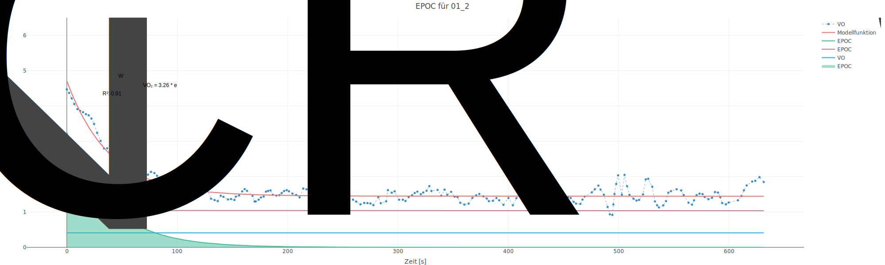{group="Proband 01"}

### Test 3

{group="Proband 01"}

### Test 4

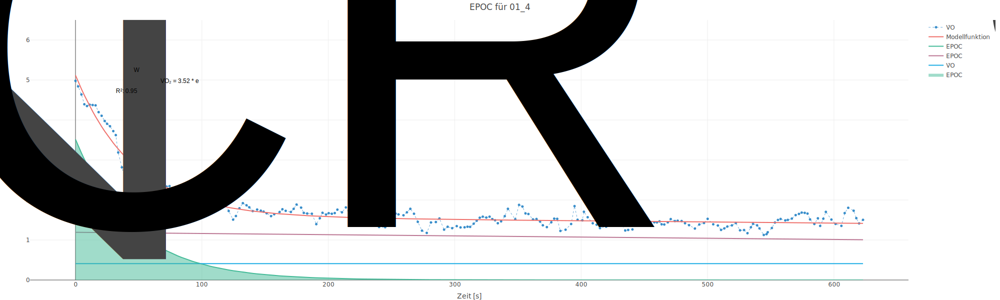{group="Proband 01"}

### Test 5

{group="Proband 01"}

### Test 6

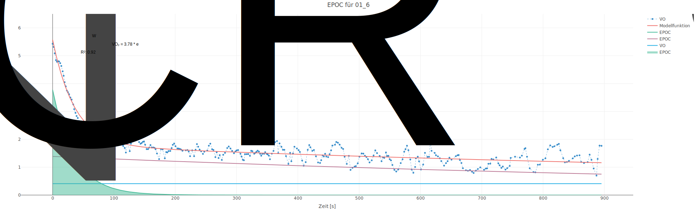{group="Proband 01"}
:::


## Proband 06 {.tabset}


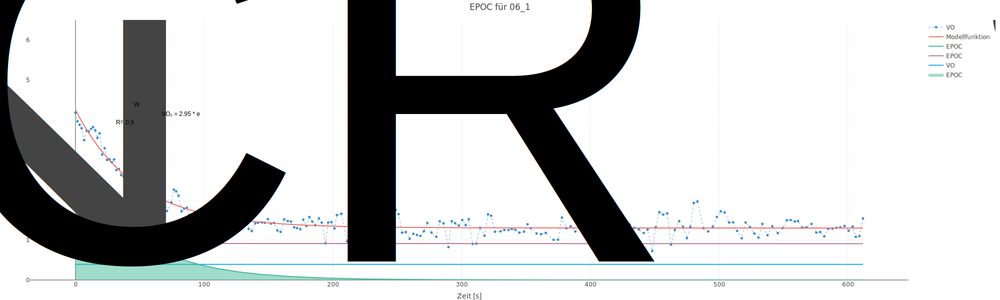{group="Proband 06"}

{group="Proband 06"}

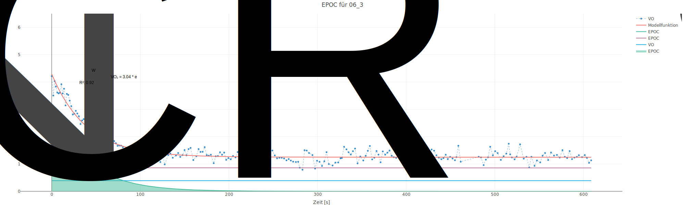{group="Proband 06"}

{group="Proband 06"}

{group="Proband 06"}

{group="Proband 06"}

## Proband 10 {.tabset}

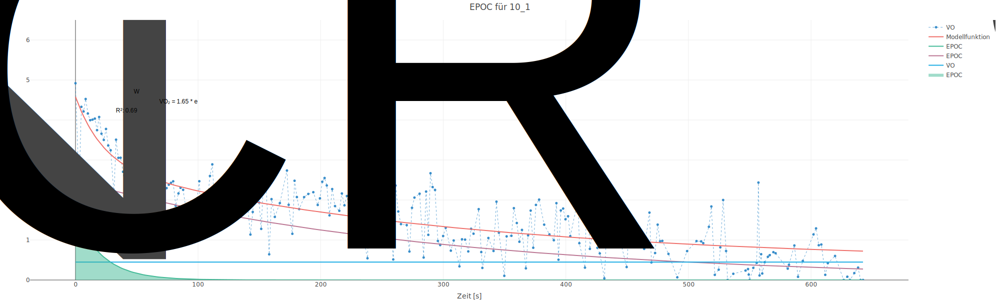{group="Proband 10"}

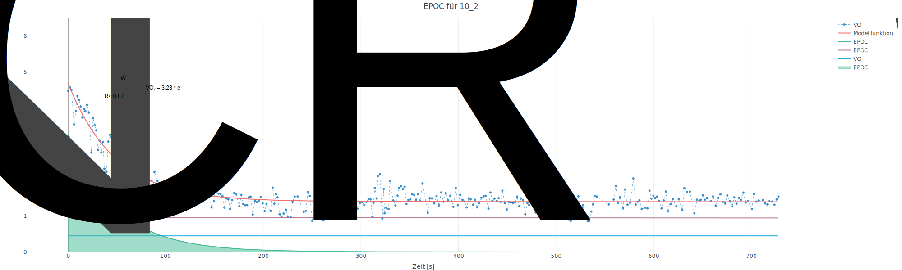{group="Proband 10"}

{group="Proband 10"}

{group="Proband 10"}

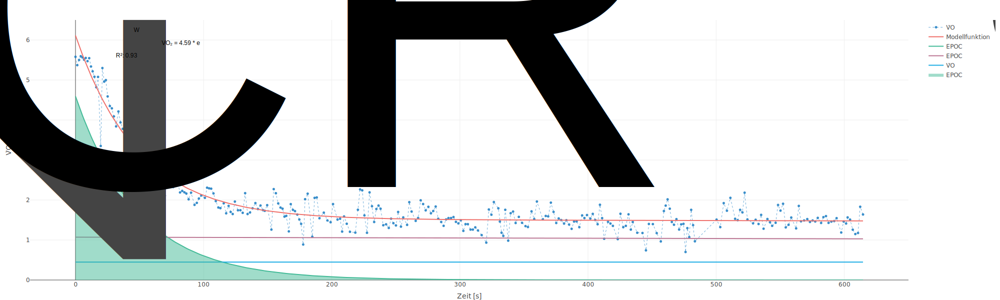{group="Proband 10"}

{group="Proband 10"}

## Proband 13 {.tabset}

{group="Proband 13"}

{group="Proband 13"}

{group="Proband 13"}

{group="Proband 13"}

{group="Proband 13"}

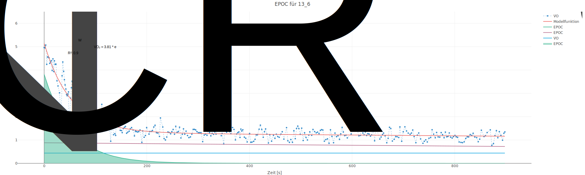{group="Proband 13"}

## Proband 15 {.tabset}

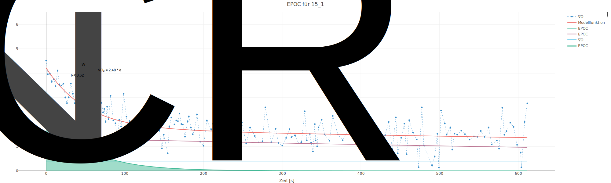{group="Proband 15"}

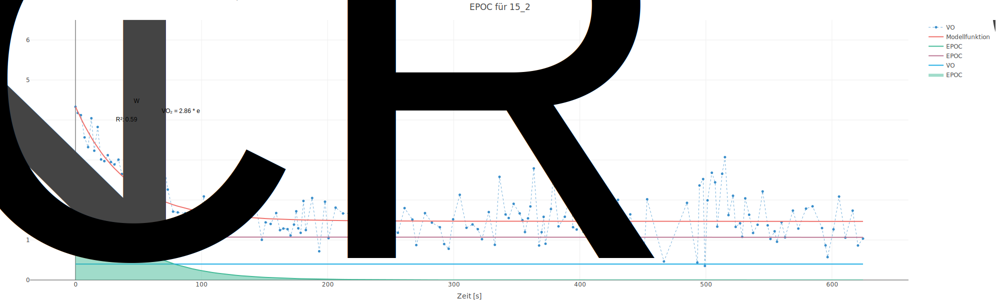{group="Proband 15"}

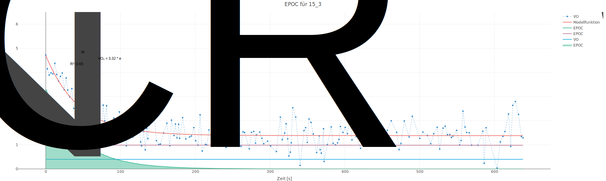{group="Proband 15"}

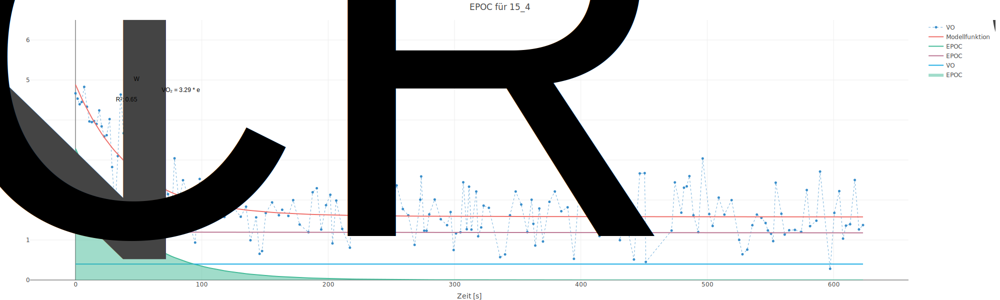{group="Proband 15"}

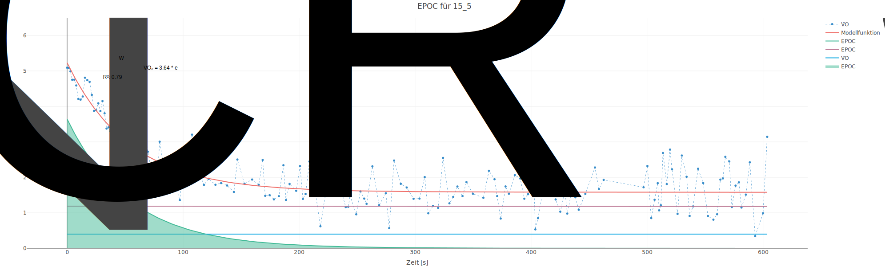{group="Proband 15"}

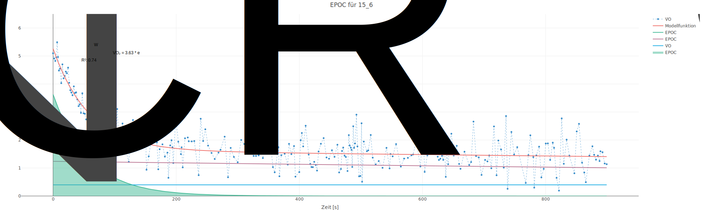{group="Proband 15"}

## Proband 19 {.tabset}

{group="Proband 19"}

{group="Proband 19"}

{group="Proband 19"}

{group="Proband 19"}

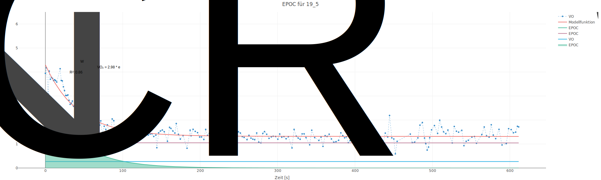{group="Proband 19"}

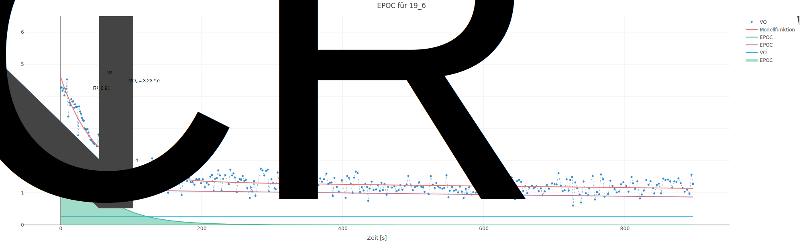{group="Proband 19"}

## Proband 20 {.tabset}

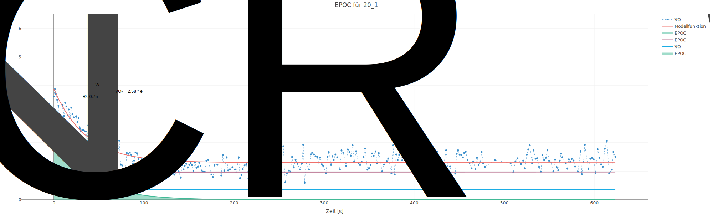{group="Proband 20"}

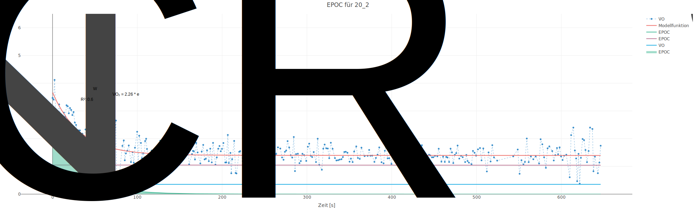{group="Proband 20"}

{group="Proband 20"}

{group="Proband 20"}

{group="Proband 20"}

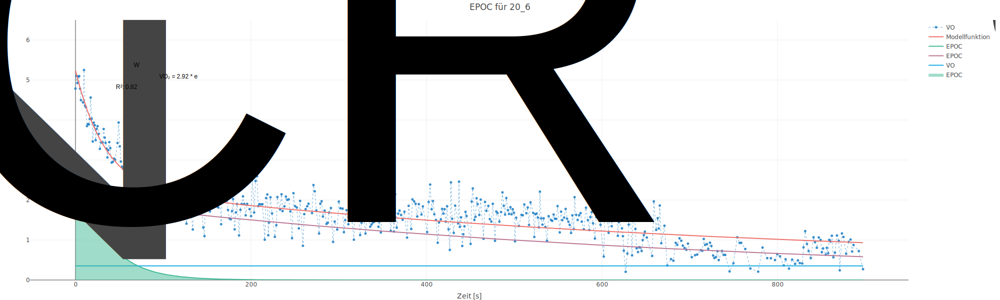{group="Proband 20"}

## Proband 22 {.tabset}

{group="Proband 22"}

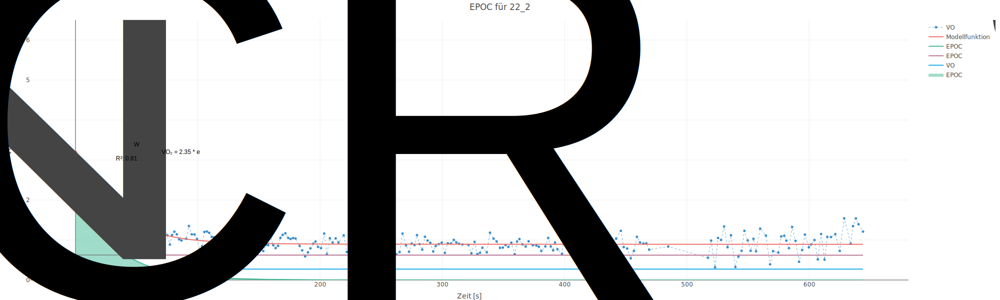{group="Proband 22"}

{group="Proband 22"}

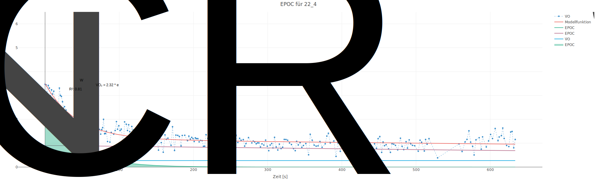{group="Proband 22"}

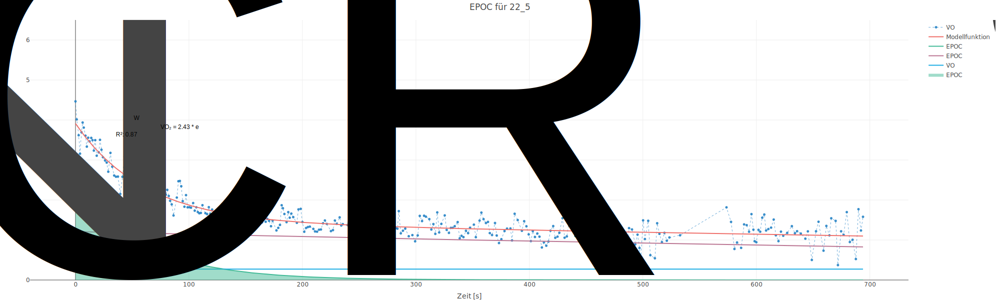{group="Proband 22"}

{group="Proband 22"}

## Proband 23 {.tabset}

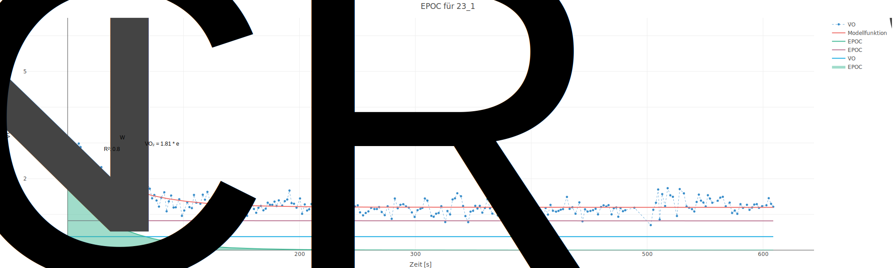{group="Proband 23"}

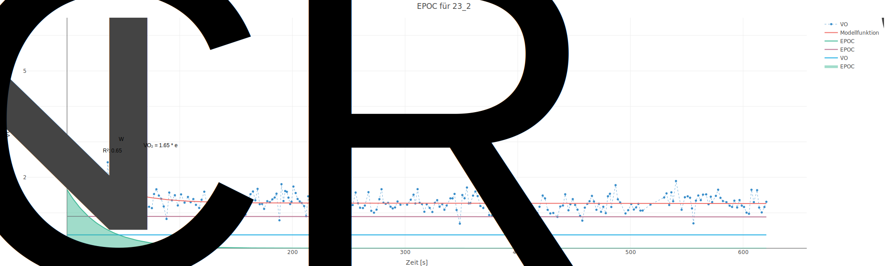{group="Proband 23"}

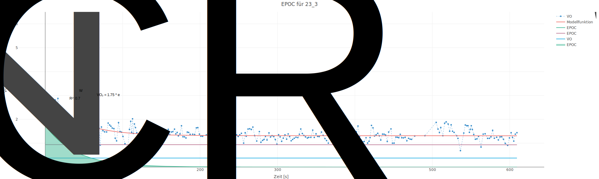{group="Proband 23"}

{group="Proband 23"}

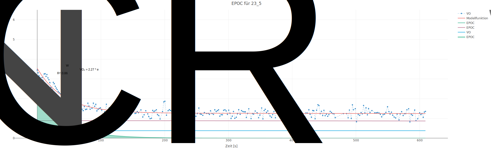{group="Proband 23"}

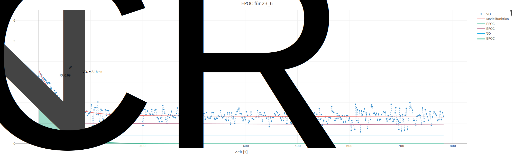{group="Proband 23"}
