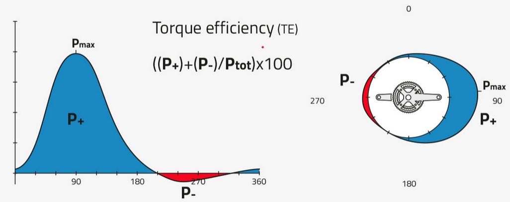
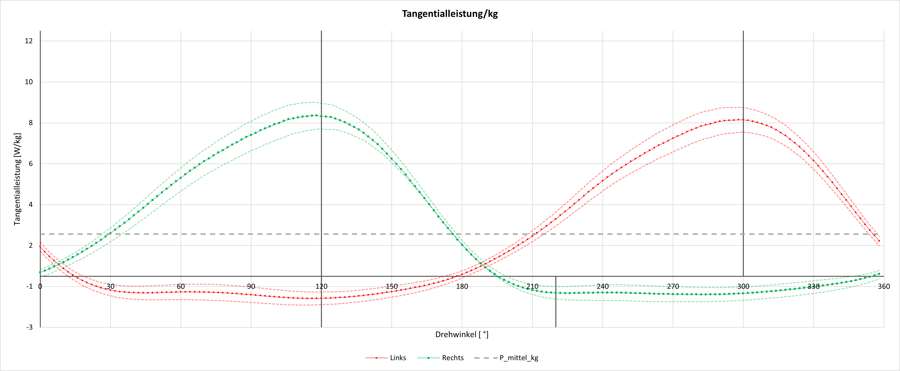
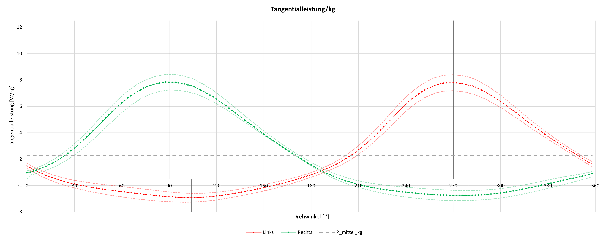
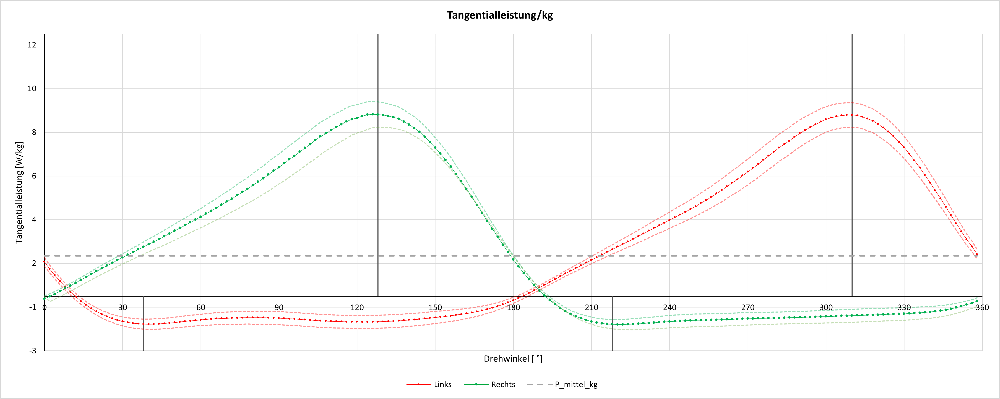
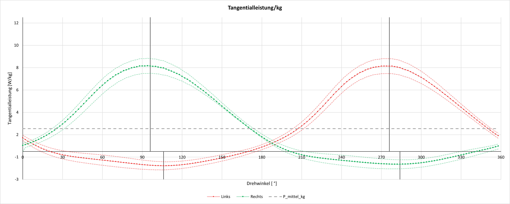
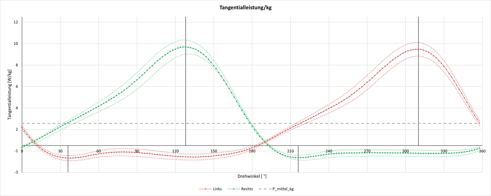
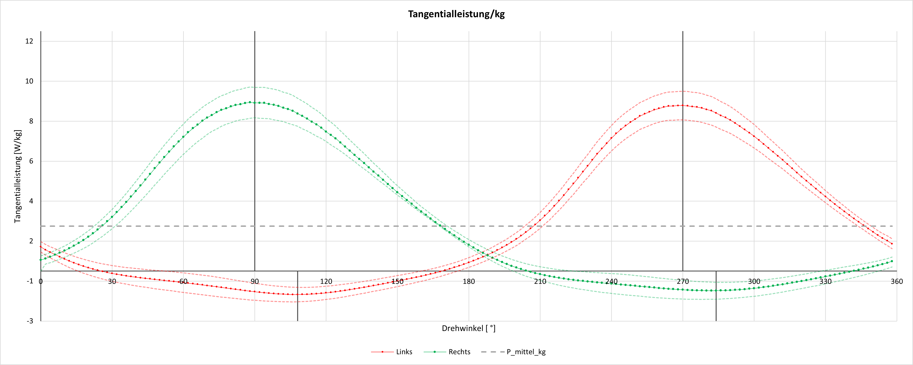
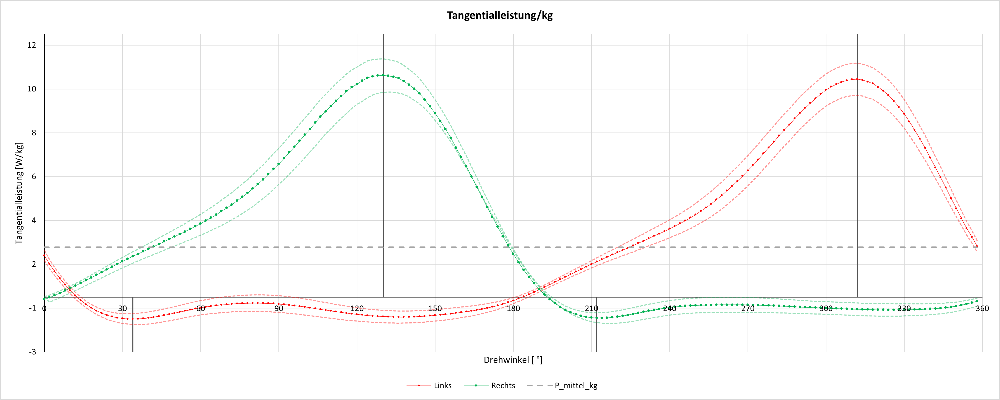
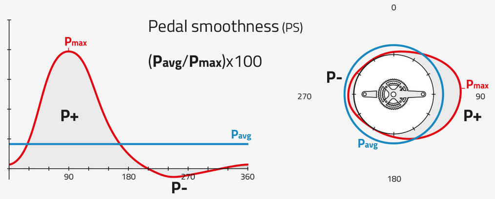

---
execute:
  message: false
  echo: false
  warning: false
  error: false

---


# Ergometer - Daten


```{r}
# Library und dfs laden
library(plotly)
library(ggplot2)
library(dplyr)
library(tidyr)
library(htmltools)
library(htmlwidgets)
library(shiny)
library(DT)
library(RColorBrewer)
library(patchwork)
library(minpack.lm)
library(zoo)
library(purrr)
library(readxl)

# Laden des DataFrames EPOC_data, Erg_data und BLC_data aus der RDS-Datei
EPOC_data_df <- readRDS("C:/Users/johan/OneDrive/Desktop/SpoWi/WS 22,23/Masterarbeit - Wirkungsgrad/Daten/Probanden_Energieberechnung/xlsm/EPOC_data_df.rds")
Erg_data_df <- readRDS("C:/Users/johan/OneDrive/Desktop/SpoWi/WS 22,23/Masterarbeit - Wirkungsgrad/Daten/Probanden_Energieberechnung/xlsm/Erg_data_df.rds")
Erg_data_komplett <- readRDS("C:/Users/johan/OneDrive/Desktop/SpoWi/WS 22,23/Masterarbeit - Wirkungsgrad/Daten/Probanden_Energieberechnung/xlsm/Erg_data_komplett.rds")
Messwerte_Bedingungen_df <- readRDS("C:/Users/johan/OneDrive/Desktop/SpoWi/WS 22,23/Masterarbeit - Wirkungsgrad/Daten/Probanden_Energieberechnung/xlsm/Messwerte_Bedingungen_df.rds")
Messwerte_Intensitäten_df <- readRDS("C:/Users/johan/OneDrive/Desktop/SpoWi/WS 22,23/Masterarbeit - Wirkungsgrad/Daten/Probanden_Energieberechnung/xlsm/Messwerte_Intensitäten_df.rds")
Messwerte_Bedingung_Intensität_df <- readRDS("C:/Users/johan/OneDrive/Desktop/SpoWi/WS 22,23/Masterarbeit - Wirkungsgrad/Daten/Probanden_Energieberechnung/xlsm/Messwerte_Bedingung_Intensität_df.rds")
Bedingungen_data <- readRDS("C:/Users/johan/OneDrive/Desktop/SpoWi/WS 22,23/Masterarbeit - Wirkungsgrad/Daten/Probanden_Energieberechnung/xlsm/Bedingungen_data.rds")
P_Ges_df<- readRDS("C:/Users/johan/OneDrive/Desktop/SpoWi/WS 22,23/Masterarbeit - Wirkungsgrad/Daten/Probanden_Energieberechnung/xlsm/Efficiency_Daten_df.rds")
Efficiency_df<- readRDS("C:/Users/johan/OneDrive/Desktop/SpoWi/WS 22,23/Masterarbeit - Wirkungsgrad/Daten/Probanden_Energieberechnung/xlsm/Efficiency_Daten_df.rds")
P_Int_Drehzahl_Masse <- readRDS("C:/Users/johan/OneDrive/Desktop/SpoWi/WS 22,23/Masterarbeit - Wirkungsgrad/Daten/Probanden_Energieberechnung/xlsm/P_Int_Drehzahl_Masse.rds")
Simulation_df <- readRDS("C:/Users/johan/OneDrive/Desktop/SpoWi/WS 22,23/Masterarbeit - Wirkungsgrad/Daten/Probanden_Energieberechnung/xlsm/Simulation_df.rds")
ΔBLC_list <- readRDS("C:/Users/johan/OneDrive/Desktop/SpoWi/WS 22,23/Masterarbeit - Wirkungsgrad/Daten/Probanden_Energieberechnung/xlsm/BLC_list.rds")
proband_data <- readRDS("C:/Users/johan/OneDrive/Desktop/SpoWi/WS 22,23/Masterarbeit - Wirkungsgrad/Daten/Probanden_Energieberechnung/xlsm/proband_data.rds")
ΔBLC_data_df <- readRDS("C:/Users/johan/OneDrive/Desktop/SpoWi/WS 22,23/Masterarbeit - Wirkungsgrad/Daten/Probanden_Energieberechnung/xlsm/BLC_data_df.rds")
BLC_Modell_list <- readRDS("C:/Users/johan/OneDrive/Desktop/SpoWi/WS 22,23/Masterarbeit - Wirkungsgrad/Daten/Probanden_Energieberechnung/xlsm/BLC_Modell_list.rds")
Efficiency_Daten_df <- readRDS("C:/Users/johan/OneDrive/Desktop/SpoWi/WS 22,23/Masterarbeit - Wirkungsgrad/Daten/Probanden_Energieberechnung/xlsm/Efficiency_Daten_df.rds")
P_R_list <- readRDS("C:/Users/johan/OneDrive/Desktop/SpoWi/WS 22,23/Masterarbeit - Wirkungsgrad/Daten/Probanden_Energieberechnung/xlsm/P_R_list.rds")
P_L_list <- readRDS("C:/Users/johan/OneDrive/Desktop/SpoWi/WS 22,23/Masterarbeit - Wirkungsgrad/Daten/Probanden_Energieberechnung/xlsm/P_L_list.rds")
start_vals_list <- readRDS ("C:/Users/johan/OneDrive/Desktop/SpoWi/WS 22,23/Masterarbeit - Wirkungsgrad/Daten/Probanden_Energieberechnung/xlsm/start_vals_list.rds")
VO2_list <- readRDS ("C:/Users/johan/OneDrive/Desktop/SpoWi/WS 22,23/Masterarbeit - Wirkungsgrad/Daten/Probanden_Energieberechnung/xlsm/VO2_list.rds")
df_anthropometrisch_female <- readRDS ("C:/Users/johan/OneDrive/Desktop/SpoWi/WS 22,23/Masterarbeit - Wirkungsgrad/Daten/Probanden_Energieberechnung/xlsm/df_anthropometrisch_female.rds")
df_anthropometrisch_male <- readRDS ("C:/Users/johan/OneDrive/Desktop/SpoWi/WS 22,23/Masterarbeit - Wirkungsgrad/Daten/Probanden_Energieberechnung/xlsm/df_anthropometrisch_male.rds")
```

## Messwerte im Belastungszeitraum {.tabset}

### Innere Arbeit {.tabset}

#### Anthropometrische Tabellen
##### Row {.flow}
::: card 
::: card-header 
Weiblich
:::
::: card-body 

```{r}

# Nachkommastellen runden
df_anthropometrisch_female <- df_anthropometrisch_female %>%
  mutate_at(vars(everything()), round, 2)

# Datentabelle mit DT darstellen
datatable(df_anthropometrisch_female)

```

:::
:::

##### Row {.flow}
::: card 
::: card-header 
Männlich
:::
::: card-body 


```{r}
# Nachkommstellen runden
df_anthropometrisch_male <- df_anthropometrisch_male %>%
  mutate_at(vars(everything()), round, 2)

# Datentabelle mit DT darstellen
datatable(df_anthropometrisch_male)
```

:::
:::

#### Rechenweg 
##### Row {.flow}

::: card 
::: card-header 
Rechenweg
:::
::: card-body 

```{r echo=TRUE} 

# ------------ Berechnungen_P_Int ----------
# ------------ Eingabeparameter ------------ 
# Schleife über alle Zeilen in Erg_data_df
for(i in 1:nrow(Erg_data_df)) {
  # Übernahme der Werte aus der aktuellen Zeile...
  Masse <- as.numeric(Erg_data_df[i, 'Masse'])
  lOS <- as.numeric(Erg_data_df[i, 'lOS'])
  lUS <- as.numeric(Erg_data_df[i, 'lUS'])
  lBein <- as.numeric(Erg_data_df[i, 'lBein'])
  lKurbel <- as.numeric(Erg_data_df[i, 'lKurbel'])
  uOS <- as.numeric(Erg_data_df[i, 'uOS'])
  uUS <- as.numeric(Erg_data_df[i, 'uUS'])
  nD <- as.numeric(Erg_data_df[i, 'nD'])
  Testdauer <- 300

  # Konstanten und weitere Berechnungen
  Faktor <- 1.00 # Faktor zur Anpassung des Abstandes vom Hüftgelenk zur Kurbelachse
  S <- lBein * 0.883 * Faktor # Abstand vom Hüftgelenk zur Kurbelachse - Lemond Methode
  P3x <- -0.150 # x-Koordinate von P3 (Oberflächenrepräsentant der Hüfte) [m]
  P3y <- sqrt((S^2)-(P3x^2)) # y-Koordinate von P3 (Oberflächenrepräsentant der Hüfte) [m]
  P3 <- c(P3x,P3y) # kartesische Koordinaten P3 (Oberflächenrepräsentant der Hüfte) [m]
  rRelOS <- 0.1416 # relative Segmentmasse OS
  rRelUS <- 0.0433 # relative Segmentmasse US
  lambdaOS <- 0.4095 # Abstand zw. dem proximalen Punkt des Oberschenkelsegments und dessen Schwerpunkt
  lambdaUS <- 0.4459 # Abstand proximaler Segmentpunkt - Schwerpunkt
  thetaKurbel <- 0.002 # Trägheitsmoment der Fahrradkurbel [kg m^2]
  n <- 360 # Anzahl Messwerte pro Umdrehung
  delta_t <- 60 / (n * nD) # Zeitintervalle
  T <- 60 / nD # Periodendauer einer Umdrehung
  omega <- 2 * pi * nD / 60 # mittlere Winkelgeschwindigkeit
  
  # Segmentmasse OS und US [kg]
  mOS <- Masse * rRelOS 
  mUS <- Masse * rRelUS 
  
  # Trägheitsmoment des Segments [kg m^2]
  thetaOS <- (1/4) * mOS * (uOS / (2 * pi))^2 + (1/12) * mOS * lOS^2
  thetaUS <- (1/4) * mUS * (uUS / (2 * pi))^2 + (1/12) * mUS * lUS^2
  
  # Winkel und Geschwindigkeiten berechnen
  delta_phi1 <- 2 * pi / n # Winkelintervalle
  phi1 <- seq(0, 2 * pi, by=delta_phi1) # Erstellung von Winkelintervallen für eine komplette Umdrehung
  phi1 <- phi1[-length(phi1)]  # Entfernt das letzte Element
  time <- seq(0, T, by=delta_t) # Erstellung von Zeitintervallen für eine komplette Umdrehung
  time <- time[-length(time)]  # Entfernt das letzte Element
  
  # Berechnung der kartesischen Koordinaten von Punkt P1 in Abhängigkeit von der Zeit
  P1 <- list(lKurbel * sin(phi1), lKurbel * cos(phi1))
  
  # Abstand vom Hüftgelenk zur Kurbelachse (0,0) berechnen
  G4 <- sqrt(sum(P3^2))
  
  # Berechnung des Winkels des Gestänges
  delta <- acos(P3[2] / S)
  
  # Berechnung der Länge des Verbindungssegments zw. Kurbel und Hüftgelenk > 'c' kann nicht kürzer als die Summe der Längen der Beinsegmente sein
  c <- sqrt(lKurbel^2 + S^2 - 2 * S * lKurbel * cos(phi1 + delta))
  
  # Schleife zur Anpassung des Faktors, falls c größer als die Summe der Segmentlängen ist
  while (any(lUS + lOS < c)) {
    Faktor <- Faktor - 0.01  # Verringere den Faktor um 0.01
    S <- lBein * 0.883 * Faktor  # Neuberechnung von S
    P3y <- sqrt((S^2) - (P3x^2))  # Neuberechnung von P3y
    P3 <- c(P3x, P3y)  # Neuberechnung von P3
    delta <- acos(P3[2] / S)  # Neuberechnung von delta
    c <- sqrt(lKurbel^2 + S^2 - 2 * S * lKurbel * cos(phi1 + delta))  # Neuberechnung von c
  }
  
  # Überprüfung, ob die Segmentlängen zusammen größer sind als die berechnete Länge c
  control <- sum(ifelse(lUS + lOS <= c, 1, 0))
  
  # Speichere den verwendeten Faktor in der Spalte 'Faktor_Used'
  Erg_data_df$Faktor_Used[i] <- Faktor
  
  # Winkelberechnungen für das Beinsegment    
  alpha <- asin(lKurbel * sin(phi1 + delta) / c) # Winkel zwischen Gestell und c (Verbindungsseg. zwischen Kurbel und Hüftgelenk )               
  beta <- acos((lOS^2 + c^2 - lUS^2) / (2 * lOS * c)) # Winkel zwischen Oberschenkel und L       
  
  # Berechnung der kartesischen Koordinaten von Punkt P2 in Abhängigkeit von der Zeit
  P2 <- list(P3[1] + lOS * cos(pi/2 - (alpha + beta + delta)),
             P3[2] - lOS * sin(pi/2 - (alpha + beta + delta)))
  
  # Winkelberechnungen zwischen den Segmentpunkten
  phi2 <- acos((P2[[1]] - P1[[1]]) / lUS)
  phi3 <- acos((P3[2] - P2[[2]]) / lOS)
  
  # Berechnung der kartesischen Koordinaten der Schwerpunkte der Oberschenkel- und Unterschenkelsegmente
  SpOS <- list(P3[1] - lambdaOS * (P3[1] - P2[[1]]), 
               P3[2] - lambdaOS * (P3[2] - P2[[2]]))
  SpUS <- list(P2[[1]] - lambdaUS * (P2[[1]] - P1[[1]]), 
               P2[[2]] - lambdaUS * (P2[[2]] - P1[[2]]))
  
  # Funktion zur Berechnung der Geschwindigkeit
  berechneGeschwindigkeit <- function(Sp, delta_t) {
    diff_x <- c(diff(Sp[[1]]), Sp[[1]][1] - Sp[[1]][length(Sp[[1]])])
    diff_y <- c(diff(Sp[[2]]), Sp[[2]][1] - Sp[[2]][length(Sp[[2]])])
    return(sqrt(diff_x^2 + diff_y^2) / delta_t)
  }
  
  # Anwenden der Funktion
  vOS <- berechneGeschwindigkeit(SpOS, delta_t)
  vUS <- berechneGeschwindigkeit(SpUS, delta_t)
  
  # Berechnung der translatorischen kinetischen Energie
  Ekin_trans <- 0.5 * (mOS * vOS^2 + mUS * vUS^2)
  
  # Delta der Winkelgeschwindigkeiten für zyklische Bewegung
  delta_phi2 <- c(diff(phi2), phi2[1] - phi2[length(phi2)])
  delta_phi3 <- c(diff(phi3), phi3[1] - phi3[length(phi3)])
  
  # Berechnung der Winkelgeschwindigkeiten der Schwerpunkte von Oberschenkel- und Unterschenkel
  omega_SpOS <- delta_phi2 / delta_t
  omega_SpUS <- delta_phi3 / delta_t
  omega_Kurbel <- delta_phi1 / delta_t
  
  # Trägheitsmoment des Segments (Vollzylinder, der um eine Querachse (zweizählige Symmetrieachse) rotiert) [kg m^2]
  thetaOS <- (1/4) * mOS * (uOS / (2 * pi))^2 + (1/12) * mOS * lOS^2
  thetaUS <- (1/4) * mUS * (uUS / (2 * pi))^2 + (1/12) * mUS * lUS^2
  
  # Berechnung der rotatorischen kinetischen Energie
  Ekin_rot <- 0.5 * (thetaOS * omega_SpOS^2 + thetaUS * omega_SpUS^2 + thetaKurbel * omega_Kurbel^2)
  
  # Delta der kinetischen Energie (translatorisch) für zyklische Bewegung
  delta_Ekin_trans <- c(abs(diff(Ekin_trans)), abs(Ekin_trans[1] - Ekin_trans[length(Ekin_trans)]))
  
  # Delta der kinetischen Energie (rotatorisch) für zyklische Bewegung
  delta_Ekin_rot <- c(abs(diff(Ekin_rot)), abs(Ekin_rot[1] - Ekin_rot[length(Ekin_rot)]))
  
  # Berechnung der internen Leistung für die aktuelle Drehzahl und Masse
  PInt_Mittel_Zyklus_kJ <- mean(delta_Ekin_rot) + mean(delta_Ekin_trans) / mean(delta_t)
  PInt_Ges_Watt <- PInt_Mittel_Zyklus_kJ / 1000 * Testdauer
  
  # Berechnen Sie PInt_Ges_Watt für die aktuelle Zeile und speichern Sie es im DataFrame
  Erg_data_df$PInt_Ges_Watt[i] <- PInt_Ges_Watt
}

```

:::
:::

#### Innere Arbeit 

```{r}
# Daten nach Proband und Nr sortieren
Erg_data_komplett <- Erg_data_komplett %>%
  arrange(Proband, Nr)

# Diagramm erstellen ohne explizite Farbskala
plot <- plot_ly(data = Erg_data_komplett, x = ~nD, y = ~PInt_Ges_Watt, color = ~factor(Proband),colors = colorRampPalette(brewer.pal(10,"Spectral"))(20), legendgroup = ~Proband) %>%
  add_markers(showlegend = FALSE) %>%
  layout(
    margin = list(t = 40), 
    xaxis = list(title = "nD"),
    yaxis = list(title = "P_Int_Ges_Watt"),
    title = "Berechnete Innere Arbeit",
    showlegend = TRUE  # Legende hinzufügen
  )
# Legende für die Farben der Probanden hinzufügen
for (proband_id in unique(Erg_data_komplett$Proband)) {
  plot <- plot %>% add_trace(
    data = subset(Erg_data_komplett, Proband == proband_id),
    x = ~nD,
    y = ~PInt_Ges_Watt,
    type = "scatter",
    mode = "markers",  # Nur Marker anzeigen, keine Linien
    marker = list(size = 9),
    name = paste("Proband", proband_id)
  )
}
# Diagramm anzeigen
plot


```

#### Innere Arbeit - Minetti

```{r}
# Diagramm erstellen für P_Int_Min
plot <- plot_ly(data = Erg_data_komplett, x = ~nD, y = ~P_Int_Min, color = ~factor(Proband),colors = colorRampPalette(brewer.pal(10,"Spectral"))(20), legendgroup = ~Proband) %>%
  add_markers(showlegend = FALSE) %>%
  layout(
    margin = list(t = 40), 
    xaxis = list(title = "nD"),
    yaxis = list(title = "P_Int_Min"),
    title = "Innere Arbeit nach Minetti",
    showlegend = TRUE  # Legende hinzufügen
  )
# Legende für die Farben der Probanden hinzufügen
for (proband_id in unique(Erg_data_komplett$Proband)) {
  plot <- plot %>% add_trace(
    data = subset(Erg_data_komplett, Proband == proband_id),
    x = ~nD,
    y = ~P_Int_Min,
    type = "scatter",
    mode = "markers",  # Nur Marker anzeigen, keine Linien
    marker = list(size = 9),
    name = paste("Proband", proband_id)
  )
}
# Diagramm anzeigen
plot

```

#### Innere Arbeit für versch. Körpermassen

```{r}

# Verwenden Sie direkt den DataFrame PInt_Drehzahl_Masse für das Diagramm
p <- plot_ly(P_Int_Drehzahl_Masse, x = ~Drehzahl, y = ~PInt_Ges_Watt, color = ~factor(Masse),colors = colorRampPalette(brewer.pal(10,"Spectral"))(20), type = 'scatter', mode = 'lines+markers',
             line = list(dash = 'dash'), marker = list(size = 7)) %>%
  layout(title = "P_int für verschiedene Masse- und Drehzahlwerte",
         margin = list(t = 40),
         xaxis = list(title = "Drehzahl"),
         yaxis = list(title = "P_int_Watt"))
# Diagramm anzeigen
p

```

#### Innere Arbeit für versch. Körpermassen (Minetti)

```{r}
# Daten für verschiedene Massewerte erstellen
masse_values <- seq(40, 120, by = 10)
full_data <- expand.grid(Masse = masse_values, Drehzahl = seq(40, 200, by = 5))
full_data$q <- 0.153
full_data$Testdauer <- 300

# Berechnungen durchführen
full_data <- full_data %>%
  mutate(
    Drehzahl_Hz = Drehzahl / 60,
    Umdrehungen_ges = Drehzahl_Hz * Testdauer,
    Wint_Umdrehung = q * Masse * (Drehzahl_Hz^2),
    Wint_ges_kJ = Wint_Umdrehung * Umdrehungen_ges / 1000,
    P_int_Watt = Wint_ges_kJ * 1000 / Testdauer
  )

# Plotly-Diagramm erstellen
p <- plot_ly(full_data, x = ~Drehzahl, y = ~P_int_Watt, color = ~factor(Masse), colors = colorRampPalette(brewer.pal(10,"Spectral"))(20), type = 'scatter', mode = 'lines+markers',
             line = list(dash = 'dash'), marker = list(size = 7)) %>%
  layout(title = "P_Int_Minetti für verschiedene Massewerte",
         margin = list(t = 40), 
         xaxis = list(title = "Drehzahl"),
         yaxis = list(title = "P_int_Watt"))


# Diagramm anzeigen
p
```

### Efficiency {.tabset}

#### Berechnung



#### Tangentialleistung/kg - Verlauf {.tabset}

##### Alle Bed x Int



##### Leicht x Sitzen



##### Leicht x Stehen



##### Moderat x Sitzen



##### Moderat x Stehen



##### Schwer x Sitzen



##### Schwer x Sitzen

 

#### Kreisdiagramme {.tabset}

##### Bedingungen

```{r}
# Gruppieren und Durchschnitt berechnen, Einträge mit Intensität = "niedrig" ignorieren
Efficiency_Bed_df <- Efficiency_Daten_df %>%
  group_by(Bedingung) %>%
  summarise(Efficiency = round(mean(Efficiency, na.rm = TRUE), 2)) %>%
  mutate(condition = paste(Bedingung))

# Leere Liste für die Durchschnittswerte erstellen
Bedingung_list_L <- list()
Bedingung_list_R <- list()

# Initialisiere die Durchschnittswerte für "stehen" und "sitzen"
mean_stehen_L <- numeric(180)
mean_sitzen_L <- numeric(180)
mean_stehen_R <- numeric(180)
mean_sitzen_R <- numeric(180)

# Iteriere über die Namen in P_L_list
for (name in names(P_L_list)) {
  # Prüfe, ob "stehen" im Namen vorkommt
  if (grepl("stehen", name)) {
    # Addiere den Eintrag zu mean_stehen_L
    mean_stehen_L <- mean_stehen_L + P_L_list[[name]]
  }
  # Prüfe, ob "sitzen" im Namen vorkommt
  if (grepl("sitzen", name)) {
    # Addiere den Eintrag zu mean_sitzen_L
    mean_sitzen_L <- mean_sitzen_L + P_L_list[[name]]
  }
}

# Iteriere über die Namen in P_R_list
for (name in names(P_R_list)) {
  # Prüfe, ob "stehen" im Namen vorkommt
  if (grepl("stehen", name)) {
    # Addiere den Eintrag zu mean_stehen_R
    mean_stehen_R <- mean_stehen_R + P_R_list[[name]]
  }
  # Prüfe, ob "sitzen" im Namen vorkommt
  if (grepl("sitzen", name)) {
    # Addiere den Eintrag zu mean_sitzen_R
    mean_sitzen_R <- mean_sitzen_R + P_R_list[[name]]
  }
}

# Berechne den Durchschnitt für "stehen" und "sitzen" über alle Datenpunkte
Bedingung_list_L[["stehen"]] <- mean_stehen_L / sum(grepl("stehen", names(P_L_list)))
Bedingung_list_L[["sitzen"]] <- mean_sitzen_L / sum(grepl("sitzen", names(P_L_list)))

Bedingung_list_R[["stehen"]] <- mean_stehen_R / sum(grepl("stehen", names(P_R_list)))
Bedingung_list_R[["sitzen"]] <- mean_sitzen_R / sum(grepl("sitzen", names(P_R_list)))

# Winkeldaten definieren
Winkeldaten <- seq(0, 358, by = 2)
efficiency_values <- Efficiency_Bed_df$Efficiency
names(efficiency_values) <- Efficiency_Bed_df$condition

# Schleife über die Bedingungen ("stehen" und "sitzen")
plots <- list()
for (condition in c("stehen", "sitzen")) {
  values_L <- Bedingung_list_L[[condition]]
  values_R <- Bedingung_list_R[[condition]]
  values_avg <- rowMeans(data.frame(P_R = values_R, P_L = values_L))
  adjusted_Winkeldaten <- (Winkeldaten + 180) %% 360
  
  # Vorbereitung der Datenrahmen für das Plotten
  data_L <- data.frame(theta = adjusted_Winkeldaten, r = values_L)
  data_R <- data.frame(theta = Winkeldaten, r = values_R)
  merged_data <- merge(data_L[c("theta", "r")], data_R[c("theta", "r")], by = "theta", all = FALSE)
  
  # Berechnung und Anpassung der Daten für das Plotten
  merged_data$r_avg <- rowMeans(merged_data[c("r.x", "r.y")])
  merged_data$r_avg <- ifelse(merged_data$r_avg >= 0, merged_data$r_avg + 1200, merged_data$r_avg - 1200)
  merged_data$color <- ifelse(merged_data$r_avg > 0, "#42BA97", "#EF5350")
  
  data_avg <- data.frame(theta = Winkeldaten, r = abs(merged_data$r_avg), color = merged_data$color)
  data_avg$Baseline <- 1200
  
  # Erstellung des Plots für die aktuelle Bedingung
  plot <- ggplot(data_avg, aes(x = theta, y = r, fill = color)) +
    geom_ribbon(aes(ymin = Baseline, ymax = r), alpha = 0.5) +
    geom_line(aes(color = color), size = 0.8) +
    geom_hline(yintercept = 1200, linetype = "solid", color = "black", size = 0.8) +
    scale_colour_manual(values = c("black", "black")) +
    scale_fill_manual(values = c("#42BA97", "#EF5350")) +
    coord_polar(start = 0) +
    scale_x_continuous(breaks = c(0, 90, 180, 270), labels = c("0", "90", "180", "270")) +
    theme(axis.text = element_text(color = "black", hjust = 0.2), axis.text.y = element_blank(), axis.ticks.y = element_blank(), 
          panel.grid = element_blank(), axis.title = element_blank(), panel.background = element_blank(), 
          legend.position = "none") +
    scale_y_continuous(limits = c(0, 2500))
  
  # Füge Text ein
  efficiency_value <- efficiency_values[condition]
  plot <- plot + annotate("text", x = 180, y = 1800 * 1.1, label = paste("Eff:", efficiency_value,"%"), size = 4, color = "black")
  plot <- plot + annotate("text", x = 0, y = 1800 * 1.1, label = condition, size = 4, color = "black", vjust = 0.5, hjust = 0.5)
  plot <- plot + annotate("text", x = 270, y = 1800 * 1.2, label = "P-", size = 4, color = "black")
  plot <- plot + annotate("text", x = 90, y = 1800 * 1.2, label = "P+", size = 4, color = "black")
  
  # Entferne den automatischen Titel
  plot <- plot + labs(title = NULL)
  
  # Füge den aktuellen Plot zur Liste der Plots hinzu
  plots[[condition]] <- plot
}

# Erstellen Sie die finale Abbildung, indem Sie die Plots nebeneinander anordnen
final_plot <- wrap_plots(plots, ncol = 2)

# Anzeigen der finalen Abbildung
final_plot
```

##### Intensitäten

```{r}
# Gruppieren und Durchschnitt berechnen, Einträge mit Intensität = "niedrig" ignorieren
Efficiency_Int_df <- Efficiency_Daten_df %>%
  filter(Intensität != "niedrig") %>%
  group_by(Intensität) %>%
  summarise(Efficiency = round(mean(Efficiency, na.rm = TRUE), 2)) %>%
  mutate(intensity = paste(Intensität))

# Leere Listen für die Durchschnittswerte erstellen
Intensität_list_L <- list()
Intensität_list_R <- list()

# Initialisiere die Durchschnittswerte für "leicht", "moderat" und "schwer"
mean_leicht_L <- numeric(180)
mean_moderat_L <- numeric(180)
mean_schwer_L <- numeric(180)
mean_leicht_R <- numeric(180)
mean_moderat_R <- numeric(180)
mean_schwer_R <- numeric(180)

# Iteriere über die Namen in P_L_list
for (name in names(P_L_list)) {
  # Prüfe, ob "leicht" im Namen vorkommt
  if (grepl("leicht", name)) {
    # Addiere den Eintrag zu mean_leicht_L
    mean_leicht_L <- mean_leicht_L + P_L_list[[name]]
  }
  # Prüfe, ob "moderat" im Namen vorkommt
  if (grepl("moderat", name)) {
    # Addiere den Eintrag zu mean_moderat_L
    mean_moderat_L <- mean_moderat_L + P_L_list[[name]]
  }
  # Prüfe, ob "schwer" im Namen vorkommt
  if (grepl("schwer", name)) {
    # Addiere den Eintrag zu mean_schwer_L
    mean_schwer_L <- mean_schwer_L + P_L_list[[name]]
  }
}

# Iteriere über die Namen in P_R_list
for (name in names(P_R_list)) {
  # Prüfe, ob "leicht" im Namen vorkommt
  if (grepl("leicht", name)) {
    # Addiere den Eintrag zu mean_leicht_R
    mean_leicht_R <- mean_leicht_R + P_R_list[[name]]
  }
  # Prüfe, ob "moderat" im Namen vorkommt
  if (grepl("moderat", name)) {
    # Addiere den Eintrag zu mean_moderat_R
    mean_moderat_R <- mean_moderat_R + P_R_list[[name]]
  }
  # Prüfe, ob "schwer" im Namen vorkommt
  if (grepl("schwer", name)) {
    # Addiere den Eintrag zu mean_schwer_R
    mean_schwer_R <- mean_schwer_R + P_R_list[[name]]
  }
}

# Berechne den Durchschnitt für "leicht", "moderat" und "schwer" über alle Datenpunkte
Intensität_list_L[["leicht"]] <- mean_leicht_L / sum(grepl("leicht", names(P_L_list)))
Intensität_list_L[["moderat"]] <- mean_moderat_L / sum(grepl("moderat", names(P_L_list)))
Intensität_list_L[["schwer"]] <- mean_schwer_L / sum(grepl("schwer", names(P_L_list)))

Intensität_list_R[["leicht"]] <- mean_leicht_R / sum(grepl("leicht", names(P_R_list)))
Intensität_list_R[["moderat"]] <- mean_moderat_R / sum(grepl("moderat", names(P_R_list)))
Intensität_list_R[["schwer"]] <- mean_schwer_R / sum(grepl("schwer", names(P_R_list)))

# Winkeldaten definieren
Winkeldaten <- seq(0, 358, by = 2)

efficiency_values <- Efficiency_Int_df$Efficiency
names(efficiency_values) <- Efficiency_Int_df$intensity

# Leere Liste für die ggplot-Plots erstellen
ggplot_plots <- list()

# Schleife über die Intensitäten ("leicht", "moderat" und "schwer")
for (intensity in c("leicht", "moderat", "schwer")) {
  values_L <- Intensität_list_L[[intensity]]
  values_R <- Intensität_list_R[[intensity]]
  values_avg <- rowMeans(data.frame(P_R = values_R, P_L = values_L))
  adjusted_Winkeldaten <- (Winkeldaten + 180) %% 360
  
  # Vorbereitung der Datenrahmen für das Plotten
  data_L <- data.frame(theta = adjusted_Winkeldaten, r = values_L)
  data_R <- data.frame(theta = Winkeldaten, r = values_R)
  merged_data <- merge(data_L[c("theta", "r")], data_R[c("theta", "r")], by = "theta", all = FALSE)
  
  # Berechnung und Anpassung der Daten für das Plotten
  merged_data$r_avg <- rowMeans(merged_data[c("r.x", "r.y")])
  merged_data$r_avg <- ifelse(merged_data$r_avg >= 0, merged_data$r_avg + 1200, merged_data$r_avg - 1200)
  merged_data$color <- ifelse(merged_data$r_avg > 0, "#42BA97", "#EF5350")
  
  data_avg <- data.frame(theta = Winkeldaten, r = abs(merged_data$r_avg), color = merged_data$color)
  data_avg$Baseline <- 1200
  
  # Erstellung des ggplot-Plots für die aktuelle Intensität
  plot <- ggplot(data_avg, aes(x = theta, y = r, fill = color)) +
    geom_ribbon(aes(ymin = Baseline, ymax = r), alpha = 0.5) +
    geom_line(aes(color = color), size = 0.8) +
    geom_hline(yintercept = 1200, linetype = "solid", color = "black", size = 0.8) +
    scale_colour_manual(values = c("black", "black")) +
    scale_fill_manual(values = c("#42BA97", "#EF5350")) +
    coord_polar(start = 0) +
    scale_x_continuous(breaks = c(0, 90, 180, 270), labels = c("0", "90", "180", "270")) +
    theme(axis.text = element_text(color = "black", hjust = 0.2), axis.text.y = element_blank(), axis.ticks.y = element_blank(), 
          panel.grid = element_blank(), axis.title = element_blank(), panel.background = element_blank(), 
          legend.position = "none") +
    scale_y_continuous(limits = c(0, 2500))
  
  # Füge Text ein
  efficiency_value <- efficiency_values[intensity]
  plot <- plot + annotate("text", x = 180, y = 1800 * 1.1, label = paste("Eff:", efficiency_value,"%"), size = 4, color = "black")
  plot <- plot + annotate("text", x = 0, y = 1800 * 1.1, label = intensity, size = 4, color = "black", vjust = 0.5, hjust = 0.5)
  plot <- plot + annotate("text", x = 270, y = 1800 * 1.2, label = "P-", size = 4, color = "black")
  plot <- plot + annotate("text", x = 90, y = 1800 * 1.2, label = "P+", size = 4, color = "black")
  
  # Entferne den automatischen Titel
  plot <- plot + labs(title = NULL)
  
  # Füge den ggplot-Plot zur Liste der ggplot-Plots hinzu
  ggplot_plots[[intensity]] <- plot
}

# Erstellen Sie die finale Abbildung, indem Sie die ggplot-Plots nebeneinander anordnen
final_plot <- ggplot_plots[[1]] + ggplot_plots[[2]] + ggplot_plots[[3]]

# Anzeigen der finalen Abbildung
final_plot
```

##### Bedingungen x Intensität

```{r}

# Gruppieren und Durchschnitt berechnen
Efficiency_Bed_Int_df <- Efficiency_Daten_df %>%
  group_by(Intensität, Bedingung) %>%
  summarise(Efficiency = round(mean(Efficiency, na.rm = TRUE), 2)) %>%
  mutate(intensity_condition = paste(Intensität, Bedingung, sep = "_")) 

# Leere Listen für die Durchschnittswerte erstellen
Bed_Int_list_L <- list()
Bed_Int_list_R <- list()

# Initialisiere die Durchschnittswerte für die verschiedenen Kombinationen von Intensität und Bedingung
mean_leicht_sitzen_L <- numeric(180)
mean_leicht_stehen_L <- numeric(180)
mean_moderat_sitzen_L <- numeric(180)
mean_moderat_stehen_L <- numeric(180)
mean_schwer_sitzen_L <- numeric(180)
mean_schwer_stehen_L <- numeric(180)

mean_leicht_sitzen_R <- numeric(180)
mean_leicht_stehen_R <- numeric(180)
mean_moderat_sitzen_R <- numeric(180)
mean_moderat_stehen_R <- numeric(180)
mean_schwer_sitzen_R <- numeric(180)
mean_schwer_stehen_R <- numeric(180)

# Iteriere über die Namen in P_L_list
for (name in names(P_L_list)) {
  # Prüfe, welche Kombination von Intensität und Bedingung im Namen vorkommt
  if (grepl("leicht_sitzen", name)) {
    mean_leicht_sitzen_L <- mean_leicht_sitzen_L + P_L_list[[name]]
  }
  if (grepl("leicht_stehen", name)) {
    mean_leicht_stehen_L <- mean_leicht_stehen_L + P_L_list[[name]]
  }
  if (grepl("moderat_sitzen", name)) {
    mean_moderat_sitzen_L <- mean_moderat_sitzen_L + P_L_list[[name]]
  }
  if (grepl("moderat_stehen", name)) {
    mean_moderat_stehen_L <- mean_moderat_stehen_L + P_L_list[[name]]
  }
  if (grepl("schwer_sitzen", name)) {
    mean_schwer_sitzen_L <- mean_schwer_sitzen_L + P_L_list[[name]]
  }
  if (grepl("schwer_stehen", name)) {
    mean_schwer_stehen_L <- mean_schwer_stehen_L + P_L_list[[name]]
  }
}

# Iteriere über die Namen in P_R_list
for (name in names(P_R_list)) {
  # Prüfe, welche Kombination von Intensität und Bedingung im Namen vorkommt
  if (grepl("leicht_sitzen", name)) {
    mean_leicht_sitzen_R <- mean_leicht_sitzen_R + P_R_list[[name]]
  }
  if (grepl("leicht_stehen", name)) {
    mean_leicht_stehen_R <- mean_leicht_stehen_R + P_R_list[[name]]
  }
  if (grepl("moderat_sitzen", name)) {
    mean_moderat_sitzen_R <- mean_moderat_sitzen_R + P_R_list[[name]]
  }
  if (grepl("moderat_stehen", name)) {
    mean_moderat_stehen_R <- mean_moderat_stehen_R + P_R_list[[name]]
  }
  if (grepl("schwer_sitzen", name)) {
    mean_schwer_sitzen_R <- mean_schwer_sitzen_R + P_R_list[[name]]
  }
  if (grepl("schwer_stehen", name)) {
    mean_schwer_stehen_R <- mean_schwer_stehen_R + P_R_list[[name]]
  }
}

# Berechne den Durchschnitt für die verschiedenen Kombinationen von Intensität und Bedingung über alle Datenpunkte
Bed_Int_list_L[["leicht_sitzen"]] <- mean_leicht_sitzen_L / sum(grepl("leicht_sitzen", names(P_L_list)))
Bed_Int_list_L[["leicht_stehen"]] <- mean_leicht_stehen_L / sum(grepl("leicht_stehen", names(P_L_list)))
Bed_Int_list_L[["moderat_sitzen"]] <- mean_moderat_sitzen_L / sum(grepl("moderat_sitzen", names(P_L_list)))
Bed_Int_list_L[["moderat_stehen"]] <- mean_moderat_stehen_L / sum(grepl("moderat_stehen", names(P_L_list)))
Bed_Int_list_L[["schwer_sitzen"]] <- mean_schwer_sitzen_L / sum(grepl("schwer_sitzen", names(P_L_list)))
Bed_Int_list_L[["schwer_stehen"]] <- mean_schwer_stehen_L / sum(grepl("schwer_stehen", names(P_L_list)))

Bed_Int_list_R[["leicht_sitzen"]] <- mean_leicht_sitzen_R / sum(grepl("leicht_sitzen", names(P_R_list)))
Bed_Int_list_R[["leicht_stehen"]] <- mean_leicht_stehen_R / sum(grepl("leicht_stehen", names(P_R_list)))
Bed_Int_list_R[["moderat_sitzen"]] <- mean_moderat_sitzen_R / sum(grepl("moderat_sitzen", names(P_R_list)))
Bed_Int_list_R[["moderat_stehen"]] <- mean_moderat_stehen_R / sum(grepl("moderat_stehen", names(P_R_list)))
Bed_Int_list_R[["schwer_sitzen"]] <- mean_schwer_sitzen_R / sum(grepl("schwer_sitzen", names(P_R_list)))
Bed_Int_list_R[["schwer_stehen"]] <- mean_schwer_stehen_R / sum(grepl("schwer_stehen", names(P_R_list)))

# Winkeldaten definieren
Winkeldaten <- seq(0, 358, by = 2)

# Liste der Intensitäts- und Bedingungskombinationen erstellen
intensity_conditions <- c("leicht_sitzen", "leicht_stehen", "moderat_sitzen", "moderat_stehen", "schwer_sitzen", "schwer_stehen")

efficiency_values <- Efficiency_Bed_Int_df$Efficiency
names(efficiency_values) <- Efficiency_Bed_Int_df$intensity_condition

# Filtern der Daten, um nur Werte über der Baseline zu behalten
data_avg <- data_avg[data_avg$r > data_avg$Baseline, ]
# Sortieren der Daten, sodass grüne Werte zuletzt geplottet werden
data_avg <- data_avg[order(data_avg$color == "#42BA97", decreasing = TRUE), ]

# Leere Liste für die ggplot-Plots erstellen
ggplot_plots <- list()

# Liste der Intensitäts- und Bedingungskombinationen erstellen
intensity_conditions <- c("leicht_sitzen", "leicht_stehen", "moderat_sitzen", "moderat_stehen", "schwer_sitzen", "schwer_stehen")

# Schleife über die Intensitäts- und Bedingungskombinationen
for (intensity_condition in intensity_conditions) {
  values_L <- Bed_Int_list_L[[intensity_condition]]
  values_R <- Bed_Int_list_R[[intensity_condition]]
  values_avg <- rowMeans(data.frame(P_R = values_R, P_L = values_L))
  adjusted_Winkeldaten <- (Winkeldaten + 180) %% 360
  
  # Vorbereitung der Datenrahmen für das Plotten
  data_L <- data.frame(theta = adjusted_Winkeldaten, r = values_L)
  data_R <- data.frame(theta = Winkeldaten, r = values_R)
  merged_data <- merge(data_L[c("theta", "r")], data_R[c("theta", "r")], by = "theta", all = FALSE)
  
  # Berechnung und Anpassung der Daten für das Plotten
  merged_data$r_avg <- rowMeans(merged_data[c("r.x", "r.y")])
  merged_data$r_avg <- ifelse(merged_data$r_avg >= 0, merged_data$r_avg + 800, merged_data$r_avg - 800)
  merged_data$color <- ifelse(merged_data$r_avg > 0, "#42BA97", "#EF5350")
  
  data_avg <- data.frame(theta = Winkeldaten, r = abs(merged_data$r_avg), color = merged_data$color)
  data_avg$Baseline <- 800
  
  # Erstellung des ggplot-Plots für die aktuelle Intensität und Bedingung
  plot <- ggplot(data_avg, aes(x = theta, y = r, fill = color)) +
    geom_ribbon(aes(ymin = Baseline, ymax = r), alpha = 0.65) +
    geom_point(aes(color = color), size = 0.3) +
    geom_hline(yintercept = 800, linetype = "solid", color = "black", size = 0.5) +
    geom_hline(yintercept = 800, linetype = "solid", color = "black", size = 0.5) +
    scale_colour_manual(values = c("black", "black")) +
    scale_fill_manual(values = c("#42BA97", "#EF5350")) +
    coord_polar(start = 0) +
    scale_x_continuous(breaks = c(0, 90, 180, 270), labels = c("0", "90", "180", "270")) +
    theme(axis.text = element_text(color = "black", hjust = 0.2), axis.text.y = element_blank(), axis.ticks.y = element_blank(), 
          panel.grid = element_blank(), axis.title = element_blank(), panel.background = element_blank(), 
          legend.position = "none") +
    scale_y_continuous(limits = c(0, 1800))
  
  # Füge Text ein
  efficiency_value <- efficiency_values[intensity_condition]
  plot <- plot + annotate("text", x = 178, y = 1300 * 1.1, label = paste("Eff:", efficiency_value,"%"), size = 4, color = "black")
  plot <- plot + annotate("text", x = 0, y = 1300 * 1.1, label = intensity_condition, size = 4, color = "black", vjust = 0.5, hjust = 0.5)
  plot <- plot + annotate("text", x = 270, y = 1300 * 1.2, label = "P-", size = 4, color = "black")
  plot <- plot + annotate("text", x = 90, y = 1300 * 1.2, label = "P+", size = 4, color = "black")
  
  # Entferne den automatischen Titel
  plot <- plot + labs(title = NULL)
  
  # Füge den ggplot-Plot zur Liste der ggplot-Plots hinzu
  ggplot_plots[[intensity_condition]] <- plot
}

# Erstellen Sie die finale Abbildung, indem Sie die ggplot-Plots nebeneinander anordnen
final_plot <- ggplot_plots[[1]] + ggplot_plots[[3]] + ggplot_plots[[5]] + ggplot_plots[[2]]  + ggplot_plots[[4]]  + ggplot_plots[[6]]

# Anzeigen der finalen Abbildung
final_plot
```

#### Efficiency - Bedingungen x Intensität

```{r}
### Efficiency - Bedingung x Intensität ###
# Neue Spalte für die Kombination von Intensität und Bedingung
P_Ges_df$Intensität_Bedingung <- paste(P_Ges_df$Intensität, P_Ges_df$Bedingung, sep = " - ")
scatter_fig <- plot_ly(data = P_Ges_df, x = ~Intensität_Bedingung, y = ~Efficiency, type = 'scatter', mode = 'markers',
                       color = ~factor(Proband), colors = colorRampPalette(brewer.pal(10,"Spectral"))(20),
                       marker = list(size = 10, opacity = 0.8))
scatter_fig <- scatter_fig %>% layout(margin = list(t = 40), yaxis = list(title = 'Effizienz'), xaxis = list(title = 'Intensität und Bedingung'))
scatter_fig
```

#### Efficiency vs. W_kg

```{r}
# Lineare Regression und Modellzusammenfassung
lin_reg <- lm(Efficiency ~ W_kg, data = P_Ges_df)
summary_lin_reg <- summary(lin_reg)
f_stat <- summary_lin_reg$fstatistic
p_value <- format.pval(pf(f_stat["value"], f_stat["numdf"], f_stat["dendf"], lower.tail = FALSE), digits = 4)
equation_text <- sprintf("y = %.2fx + %.2f", coef(lin_reg)["W_kg"], coef(lin_reg)["(Intercept)"])
r_squared_text <- sprintf("R² = %.2f", summary_lin_reg$r.squared)
f_stat_text <- sprintf("F (%d, %d) = %.2f, p = %s", f_stat["numdf"], f_stat["dendf"], f_stat["value"], p_value)
# Berechnung der Regressionsgeraden
w_kg_seq <- seq(min(P_Ges_df$W_kg), max(P_Ges_df$W_kg), length.out = 100)
regression_values <- predict(lin_reg, newdata = data.frame(W_kg = w_kg_seq))
# Erstellen des Plotly-Diagramms
plot_ly() %>%
  add_markers(data = P_Ges_df, x = ~W_kg, y = ~Efficiency, type = 'scatter', mode = 'markers',
              color = ~factor(Proband), colors = colorRampPalette(brewer.pal(10,"Spectral"))(20),
              marker = list(size = 9, opacity = 0.8)) %>%
  layout(title = "Efficiency vs. W_kg",
         margin = list(t = 40), 
         xaxis = list(title = "W_kg"),
         yaxis = list(title = "Efficiency")) %>%
  add_lines(x = ~w_kg_seq, y = ~regression_values, name = "Regressionslinie", line = list(color = 'darkgrey', width = 2)) %>%
  add_annotations(text = equation_text, x = min(P_Ges_df$W_kg), y = max(P_Ges_df$Efficiency), 
                  showarrow = FALSE, xanchor = 'left', yanchor = 'bottom') %>%
  add_annotations(text = r_squared_text, x = min(P_Ges_df$W_kg), y = max(P_Ges_df$Efficiency) * 0.98, 
                  showarrow = FALSE, xanchor = 'left', yanchor = 'bottom') %>%
  add_annotations(text = f_stat_text, x = min(P_Ges_df$W_kg), y = max(P_Ges_df$Efficiency) * 0.96, 
                  showarrow = FALSE, xanchor = 'left', yanchor = 'bottom')
```

#### Durchschnittliche - Efficiency x Watt/kg

```{r}
# Berechnen der Durchschnittswerte für jeden Probanden
P_Ges_Proband_df <- P_Ges_df %>%
  group_by(Proband) %>%
  summarise(Avg_W_kg = mean(W_kg, na.rm = TRUE),
            Avg_Efficiency = mean(Efficiency, na.rm = TRUE))

# Lineare Regression
lin_reg <- lm(Avg_Efficiency ~ Avg_W_kg, data = P_Ges_Proband_df)
reg_coefficients <- coef(lin_reg)
r_squared <- summary(lin_reg)$r.squared
equation_text <- sprintf("y = %.2fx + %.2f", reg_coefficients["Pedal_Smoothness"], reg_coefficients["(Intercept)"])
r_squared_text <- sprintf("R² = %.2f", r_squared)
summary_lin_reg <- summary(lin_reg)
f_stat <- summary_lin_reg$fstatistic
p_value <- format.pval(pf(f_stat["value"], f_stat["numdf"], f_stat["dendf"], lower.tail = FALSE), digits = 4)
f_stat_text <- sprintf("F (%d, %d) = %.2f, p = %s", f_stat["numdf"], f_stat["dendf"], f_stat["value"], p_value)


# Erstellen des Plotly-Diagramms
plot_ly() %>%
  add_markers(data = P_Ges_Proband_df, x = ~Avg_W_kg, y = ~Avg_Efficiency, type = 'scatter', mode = 'markers',
              color = ~factor(Proband),  colors = colorRampPalette(brewer.pal(10,"Spectral"))(20), # Benutzen einer Farbpalette mit genügend Farben
              marker = list(size = 10, opacity = 0.8)) %>%
  add_lines(x = ~Avg_W_kg, y = fitted(lin_reg), line = list(color = 'darkgrey', width = 2, opacity = 0.7), showlegend = FALSE) %>%
  layout(title = "Durchschnittliche Efficiency vs. W_kg pro Proband",
         margin = list(t = 40), 
         xaxis = list(title = "Durchschnittliches W/kg"),
         yaxis = list(title = "Durchschnittliche Efficiency")) %>%
  add_annotations(text = sprintf("y = %.2fx + %.2f", reg_coefficients["Avg_W_kg"], reg_coefficients["(Intercept)"]),
                  x = min(P_Ges_Proband_df$Avg_W_kg), y = max(P_Ges_Proband_df$Avg_Efficiency), showarrow = FALSE, xanchor = 'left') %>%
  add_annotations(text = sprintf("R² = %.2f", r_squared),
                  x = min(P_Ges_Proband_df$Avg_W_kg), y = max(P_Ges_Proband_df$Avg_Efficiency) * 0.98, showarrow = FALSE, xanchor = 'left') %>%
  add_annotations(text = f_stat_text, x = min(P_Ges_Proband_df$Avg_W_kg), y = max(P_Ges_Proband_df$Avg_Efficiency) * 0.96, 
                  showarrow = FALSE, xanchor = 'left', yanchor = 'bottom')
```

### Pedal_Smoothness {.tabset}

#### Berechnung



#### Pedal_Smoothness vs. W_kg

```{r}
# Lineare Regression
lin_reg <- lm(Pedal_Smoothness ~ W_kg, data = P_Ges_df)
reg_coefficients <- coef(lin_reg)
r_squared <- summary(lin_reg)$r.squared
equation_text <- sprintf("y = %.2fx + %.2f", reg_coefficients["W_kg"], reg_coefficients["(Intercept)"])
r_squared_text <- sprintf("R² = %.2f", r_squared)
summary_lin_reg <- summary(lin_reg)
f_stat <- summary_lin_reg$fstatistic
p_value <- format.pval(pf(f_stat["value"], f_stat["numdf"], f_stat["dendf"], lower.tail = FALSE), digits = 4)
f_stat_text <- sprintf("F (%d, %d) = %.2f, p = %s", f_stat["numdf"], f_stat["dendf"], f_stat["value"], p_value)

# Berechnung der Regressionsgeraden für eine Sequenz von W_kg
w_kg_seq <- seq(min(P_Ges_df$W_kg), max(P_Ges_df$W_kg), length.out = 100)
regression_values <- predict(lin_reg, newdata = data.frame(W_kg = w_kg_seq))

# Erstellen des Plotly-Diagramms mit Regressionsgerade und statistischen Informationen + ColorBrewer
plot_ly() %>%
  add_markers(data = P_Ges_df, x = ~W_kg, y = ~Pedal_Smoothness, type = 'scatter', mode = 'markers',
              color = ~factor(Proband), colors = colorRampPalette(brewer.pal(10,"Spectral"))(20),
              marker = list(size = 9, opacity = 0.8)) %>%
  layout(title = "Pedal_Smoothness vs. W_kg",
         margin = list(t = 40), 
         xaxis = list(title = "W_kg"),
         yaxis = list(title = "Pedal_Smoothness")) %>%
  add_lines(x = ~w_kg_seq, y = ~regression_values, name = "Regressionslinie", line = list(color = 'darkgrey', width = 2)) %>%
  add_annotations(text = equation_text, x = min(P_Ges_df$W_kg), y = max(P_Ges_df$Pedal_Smoothness), 
                  showarrow = FALSE, xanchor = 'left', yanchor = 'bottom') %>%
  add_annotations(text = r_squared_text, x = min(P_Ges_df$W_kg), y = max(P_Ges_df$Pedal_Smoothness) * 0.98, 
                  showarrow = FALSE, xanchor = 'left', yanchor = 'bottom') %>%
  add_annotations(text = f_stat_text, x = min(P_Ges_df$W_kg), y = max(P_Ges_df$Pedal_Smoothness) * 0.96, 
                  showarrow = FALSE, xanchor = 'left', yanchor = 'bottom')
```

#### Pedal_Smoothness vs. Efficiency

```{r}
# Lineare Regression
lin_reg <- lm(Pedal_Smoothness ~ Efficiency, data = P_Ges_df)
reg_coefficients <- coef(lin_reg)
r_squared <- summary(lin_reg)$r.squared
equation_text <- sprintf("y = %.2fx + %.2f", reg_coefficients["Efficiency"], reg_coefficients["(Intercept)"])
r_squared_text <- sprintf("R² = %.2f", r_squared)
summary_lin_reg <- summary(lin_reg)
f_stat <- summary_lin_reg$fstatistic
p_value <- format.pval(pf(f_stat["value"], f_stat["numdf"], f_stat["dendf"], lower.tail = FALSE), digits = 4)
f_stat_text <- sprintf("F (%d, %d) = %.2f, p = %s", f_stat["numdf"], f_stat["dendf"], f_stat["value"], p_value)

# Berechnung der Regressionsgeraden für eine Sequenz von Efficiency
Efficiency_seq <- seq(min(P_Ges_df$Efficiency), max(P_Ges_df$Efficiency), length.out = 100)
regression_values <- predict(lin_reg, newdata = data.frame(Efficiency = Efficiency_seq))

# Erstellen des Plotly-Diagramms mit Regressionsgerade und statistischen Informationen + ColorBrewer
plot_ly() %>%
  add_markers(data = P_Ges_df, x = ~Efficiency, y = ~Pedal_Smoothness, type = 'scatter', mode = 'markers',
              color = ~factor(Proband), colors = colorRampPalette(brewer.pal(10,"Spectral"))(20),
              marker = list(size = 9, opacity = 0.8)) %>%
  layout(title = "Pedal_Smoothness vs. Efficiency",
         margin = list(t = 40), 
         xaxis = list(title = "Efficiency"),
         yaxis = list(title = "Pedal_Smoothness")) %>%
  add_lines(x = ~Efficiency_seq, y = ~regression_values, name = "Regressionslinie", line = list(color = 'darkgrey', width = 2)) %>%
  add_annotations(text = equation_text, x = min(P_Ges_df$Efficiency), y = max(P_Ges_df$Pedal_Smoothness), 
                  showarrow = FALSE, xanchor = 'left', yanchor = 'bottom') %>%
  add_annotations(text = r_squared_text, x = min(P_Ges_df$Efficiency), y = max(P_Ges_df$Pedal_Smoothness) * 0.98, 
                  showarrow = FALSE, xanchor = 'left', yanchor = 'bottom') %>%
  add_annotations(text = f_stat_text, x = min(P_Ges_df$Efficiency), y = max(P_Ges_df$Pedal_Smoothness) * 0.96, 
                  showarrow = FALSE, xanchor = 'left', yanchor = 'bottom')
```

### Simulationsmodell - Innere Arbeit

```{r}
# ------------ Eingabeparameter ------------ 

mSp <- 90 # Masse Sportler [kg]
lOS <- 0.60 # Länge des Segments Oberschenkel [m]
lUS <- 0.55 # Länge des Segments Unterschenkel [m]
lBein <- 0.90# # Innenbeinlänge [m]
uOS <- 0.54 # Umfang OS [m]
uUS <- 0.38 # Umfang US [m]
lKurbel <- 0.175 # Kurbellänge [m]
thetaKurbel <- 0.002 # Trägheitsmoment der Fahrradkurbel [kg m^2]

P3 <- c(-0.200, 0.88) # kartesische Koordinaten P3 (Oberflächenrepräsentant der Hüfte) [m]

lambdaOS <- 0.4095 # Abstand zw. dem proximalen Punkt (in der Nähe des Körpers) des Oberschenkelsegments und dessen Schwerpunkt
lambdaUS <- 0.4459 # Abstand proximaler Segmentpunkt - Schwerpunkt

rRelOS <- 0.1416 # relative Segmentmasse OS
rRelUS <- 0.0433 # relative Segmentmasse US

n <- 360 # Anzahl Messwerte pro Umdrehung 
nD <- 80 # Drehzahl

Testdauer <- 300

# ------------ Berechnungen ------------ 
# Zeitintervalle
delta_t <- 60 / (n * nD)
T <- 60 / nD
time <- seq(0, T, by=delta_t)

# Abstand vom Hüftgelenk zur Kurbelachse (0,0) berechnen
S <- sqrt(sum(P3^2))

# Segmentmasse OS und US [kg]
mOS <- mSp * rRelOS 
mUS <- mSp * rRelUS 

# Trägheitsmoment des Segments (Vollzylinder, der um eine Querachse (zweizählige Symmetrieachse) rotiert) [kg m^2]
thetaOS <- (1/4) * mOS * (uOS / (2 * pi))^2 + (1/12) * mOS * lOS^2
thetaUS <- (1/4) * mUS * (uUS / (2 * pi))^2 + (1/12) * mUS * lUS^2

# Abstand Hüftgelenk-Kurbelachse (0,0)
SPraxis <- 0.885 * lBein

# Winkelintervalle
delta_phi1 <- 2 * pi / n
phi1 <- seq(0, 2 * pi, by=delta_phi1)
phi1 <- phi1[-length(phi1)]  # Entfernt das letzte Element
phi1_deg = phi1 * (180 / pi) # phi1 in Grad umrechnen
omega <- 2 * pi * nD / 60

# ------------- Simulationsmodell ---------------
# P0 definieren
P0_x <- 0
P0_y <- 0

# Winkel in Grad umrechnen
phi1_deg = phi1 * (180 / pi)

# Erstellen des Diagramms mit Plotly
fig <- Simulation_df %>%
  plot_ly() %>%
  
  # Trace für P1
  add_trace(
    x = ~x1,
    y = ~y1,
    text = ~paste("Winkel:", phi1_deg),
    ids = ~phi1_deg,
    frame = ~phi1_deg,
    type = 'scatter',
    mode = 'markers',
    marker = list( size = 5),
    name = "P1"
  ) %>%
  
  # Trace für P2
  add_trace(
    x = ~x2,
    y = ~y2,
    text = ~paste("Winkel:", phi1_deg),
    ids = ~phi1_deg,
    frame = ~phi1_deg,
    type = 'scatter',
    mode = 'markers',
    marker = list(size = 5),
    name = "P2"
  ) %>%
  
  # Trace für P3
  add_trace(
    x = ~x3,
    y = ~y3,
    text = ~paste("Winkel:", phi1_deg),
    ids = ~phi1_deg,
    frame = ~phi1_deg,
    type = 'scatter',
    mode = 'markers',
    marker = list(size = 5),
    name = "P3"
  ) %>%
  
  # Segment von P0 zu P1
  add_segments(
    x = ~x0, xend = ~x1,
    y = ~y0, yend = ~y1,
    ids = ~phi1_deg,
    frame = ~phi1_deg,
    line = list(color = 'black'),
    showlegend = FALSE
  ) %>%
  
  # Segment von P1 zu P2
  add_segments(
    x = ~x1, xend = ~x2,
    y = ~y1, yend = ~y2,
    ids = ~phi1_deg,
    frame = ~phi1_deg,
    line = list(color = 'darkgrey'),
    showlegend = FALSE
  ) %>%
  
  # Segment von P2 zu P3
  add_segments(
    x = ~x2, xend = ~x3,
    y = ~y2, yend = ~y3,
    ids = ~phi1_deg,
    frame = ~phi1_deg,
    line = list(color = 'darkgrey'),
    showlegend = FALSE
  ) %>%
  
  layout(
    margin = list(t = 40), 
    xaxis = list(title = "X-Koordinate", range = c(-1.0, 1.0)),
    yaxis = list(title = "Y-Koordinate", range = c(-1.0, 1.0)),
    title = "Radmodell",
    aspectratio = list(x = 1, y = 1)  # Hier wird das Seitenverhältnis auf 1:1 gesetzt
  ) %>%
  
  animation_opts(
    frame = 1,
    transition = 1,
    easing = "linear",
    redraw = FALSE,
    mode = "immediate"
  ) %>%
  
  animation_button(
    x = 1, xanchor = "right", y = 0, yanchor = "bottom"
  ) %>%
  
  animation_slider(
    currentvalue = list(prefix = "Winkel ")
  )

fig

```
