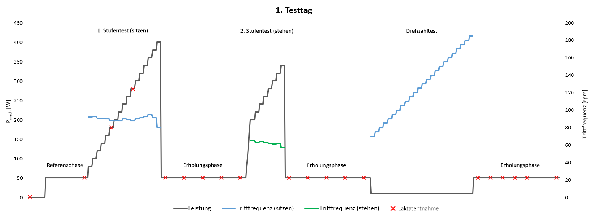
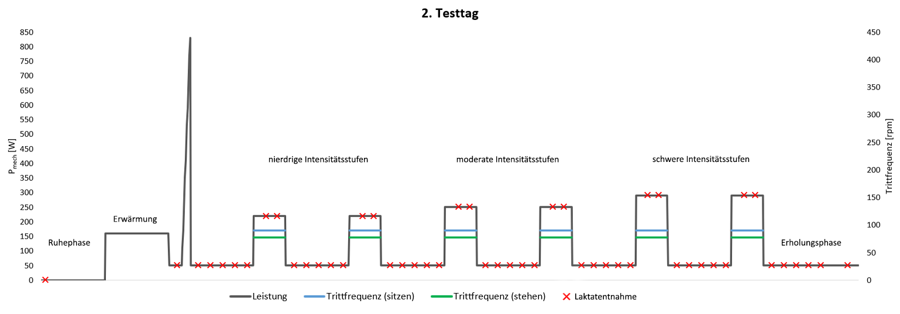

```{r}
# Library und dfs laden
library(plotly)
library(ggplot2)
library(dplyr)
library(tidyr)
library(htmltools)
library(htmlwidgets)
library(shiny)
library(DT)
library(RColorBrewer)
library(patchwork)
library(minpack.lm)
library(zoo)
library(purrr)
library(readxl)

# Laden des DataFrames EPOC_data, Erg_data und BLC_data aus der RDS-Datei
EPOC_data_df <- readRDS("C:/Users/johan/OneDrive/Desktop/SpoWi/WS 22,23/Masterarbeit - Wirkungsgrad/Daten/Probanden_Energieberechnung/xlsm/EPOC_data_df.rds")
Erg_data_df <- readRDS("C:/Users/johan/OneDrive/Desktop/SpoWi/WS 22,23/Masterarbeit - Wirkungsgrad/Daten/Probanden_Energieberechnung/xlsm/Erg_data_df.rds")
Erg_data_komplett <- readRDS("C:/Users/johan/OneDrive/Desktop/SpoWi/WS 22,23/Masterarbeit - Wirkungsgrad/Daten/Probanden_Energieberechnung/xlsm/Erg_data_komplett.rds")
Messwerte_Bedingungen_df <- readRDS("C:/Users/johan/OneDrive/Desktop/SpoWi/WS 22,23/Masterarbeit - Wirkungsgrad/Daten/Probanden_Energieberechnung/xlsm/Messwerte_Bedingungen_df.rds")
Messwerte_Intensitäten_df <- readRDS("C:/Users/johan/OneDrive/Desktop/SpoWi/WS 22,23/Masterarbeit - Wirkungsgrad/Daten/Probanden_Energieberechnung/xlsm/Messwerte_Intensitäten_df.rds")
Messwerte_Bedingung_Intensität_df <- readRDS("C:/Users/johan/OneDrive/Desktop/SpoWi/WS 22,23/Masterarbeit - Wirkungsgrad/Daten/Probanden_Energieberechnung/xlsm/Messwerte_Bedingung_Intensität_df.rds")
Bedingungen_data <- readRDS("C:/Users/johan/OneDrive/Desktop/SpoWi/WS 22,23/Masterarbeit - Wirkungsgrad/Daten/Probanden_Energieberechnung/xlsm/Bedingungen_data.rds")
P_Ges_df<- readRDS("C:/Users/johan/OneDrive/Desktop/SpoWi/WS 22,23/Masterarbeit - Wirkungsgrad/Daten/Probanden_Energieberechnung/xlsm/Efficiency_Daten_df.rds")
Efficiency_df<- readRDS("C:/Users/johan/OneDrive/Desktop/SpoWi/WS 22,23/Masterarbeit - Wirkungsgrad/Daten/Probanden_Energieberechnung/xlsm/Efficiency_Daten_df.rds")
P_Int_Drehzahl_Masse <- readRDS("C:/Users/johan/OneDrive/Desktop/SpoWi/WS 22,23/Masterarbeit - Wirkungsgrad/Daten/Probanden_Energieberechnung/xlsm/P_Int_Drehzahl_Masse.rds")
Simulation_df <- readRDS("C:/Users/johan/OneDrive/Desktop/SpoWi/WS 22,23/Masterarbeit - Wirkungsgrad/Daten/Probanden_Energieberechnung/xlsm/Simulation_df.rds")
ΔBLC_list <- readRDS("C:/Users/johan/OneDrive/Desktop/SpoWi/WS 22,23/Masterarbeit - Wirkungsgrad/Daten/Probanden_Energieberechnung/xlsm/BLC_list.rds")
proband_data <- readRDS("C:/Users/johan/OneDrive/Desktop/SpoWi/WS 22,23/Masterarbeit - Wirkungsgrad/Daten/Probanden_Energieberechnung/xlsm/proband_data.rds")
ΔBLC_data_df <- readRDS("C:/Users/johan/OneDrive/Desktop/SpoWi/WS 22,23/Masterarbeit - Wirkungsgrad/Daten/Probanden_Energieberechnung/xlsm/BLC_data_df.rds")
BLC_Modell_list <- readRDS("C:/Users/johan/OneDrive/Desktop/SpoWi/WS 22,23/Masterarbeit - Wirkungsgrad/Daten/Probanden_Energieberechnung/xlsm/BLC_Modell_list.rds")
Efficiency_Daten_df <- readRDS("C:/Users/johan/OneDrive/Desktop/SpoWi/WS 22,23/Masterarbeit - Wirkungsgrad/Daten/Probanden_Energieberechnung/xlsm/Efficiency_Daten_df.rds")
P_R_list <- readRDS("C:/Users/johan/OneDrive/Desktop/SpoWi/WS 22,23/Masterarbeit - Wirkungsgrad/Daten/Probanden_Energieberechnung/xlsm/P_R_list.rds")
P_L_list <- readRDS("C:/Users/johan/OneDrive/Desktop/SpoWi/WS 22,23/Masterarbeit - Wirkungsgrad/Daten/Probanden_Energieberechnung/xlsm/P_L_list.rds")
start_vals_list <- readRDS ("C:/Users/johan/OneDrive/Desktop/SpoWi/WS 22,23/Masterarbeit - Wirkungsgrad/Daten/Probanden_Energieberechnung/xlsm/start_vals_list.rds")
VO2_list <- readRDS ("C:/Users/johan/OneDrive/Desktop/SpoWi/WS 22,23/Masterarbeit - Wirkungsgrad/Daten/Probanden_Energieberechnung/xlsm/VO2_list.rds")
df_anthropometrisch_female <- readRDS ("C:/Users/johan/OneDrive/Desktop/SpoWi/WS 22,23/Masterarbeit - Wirkungsgrad/Daten/Probanden_Energieberechnung/xlsm/df_anthropometrisch_female.rds")
df_anthropometrisch_male <- readRDS ("C:/Users/johan/OneDrive/Desktop/SpoWi/WS 22,23/Masterarbeit - Wirkungsgrad/Daten/Probanden_Energieberechnung/xlsm/df_anthropometrisch_male.rds")
```

# Informationen Studie
## Row {.flow height=30%}
::: card
::: card-header
Testtag 1
:::
::: card-body


> Abbildungen werden in der MA noch angepasst 

:::
:::

::: card
::: card-header
Testtag 2
:::
::: card-body


> Abbildungen werden in der MA noch angepasst 

:::
:::

## Row {.flow height=70%}
::: card
::: card-header
Stichprobe
:::
::: card-body

```{r}
# Excel-Datei einlesen
Stichprobe_df <- read_excel("C:/Users/johan/OneDrive/Desktop/SpoWi/WS 22,23/Masterarbeit - Wirkungsgrad/Daten/Probanden_Daten 2.2.xlsm", sheet = "Stichprobe", range = "A1:Y12", col_names = TRUE)

# Alle Kommas in den Zellen durch Punkte ersetzen
Stichprobe_df <- Stichprobe_df %>% 
  mutate_all(~gsub(",", ".", .))

# Spalten außer der zweiten in numerische Spalten umwandeln
Stichprobe_df <- Stichprobe_df %>% 
  mutate_if(!colnames(.) == colnames(Stichprobe_df)[2], as.numeric)

# Spalten 8, 10, 13, 15, 17, 19, 21 auf zwei Nachkommastellen runden
Stichprobe_df <- Stichprobe_df %>%
  mutate_at(vars(8, 10, 13, 15, 17, 19, 21, 23), ~round(., 2))

# Datentabelle mit DT darstellen
datatable(Stichprobe_df)

```

> Proband 2 und 3 wurden aufgrund fehlender oder schlechter Versuchsdaten entfernt
:::
:::